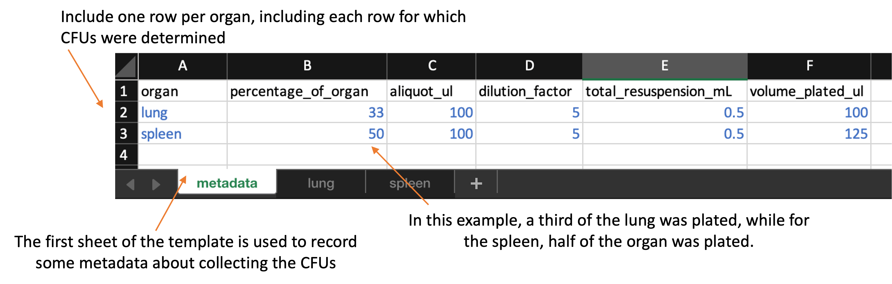
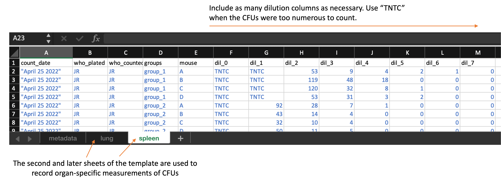

```{r global options, echo=FALSE, message=FALSE, warning=FALSE}
knitr::opts_chunk$set(echo = FALSE, error = FALSE, message = FALSE, warning = FALSE)
```


# Colony forming units to determine bacterial counts 

### Downloads

The downloads for this chapter are: 

- [Data collection template](https://github.com/csu-impactb/CODING-TEAM-BOOKDOWN-/raw/main/templates/data_collection_templates/cfu_collection_template.xlsx) for recording colony forming units counted on each 
plate or section of plate in the laboratory
- [Report template](https://raw.githubusercontent.com/csu-impactb/CODING-TEAM-BOOKDOWN-/main/templates/report_templates/cfu_report.Rmd) to process data collected with the data template (when you go to this link, go to the "File" bar in your browser's menu bar, chose "Save As", then save the file as "animal_weights.Rmd")
- [Example output](https://github.com/csu-impactb/CODING-TEAM-BOOKDOWN-/raw/main/templates/report_templates/cfu_report.docx) from the report template

### Overview TEST

In the experiments, we will need to estimate the bacterial load of
*Mycobacterium tuberculosis* in organs---including lungs and spleens---of
animals from experiments. These measurements help us assess how well a vaccine
has worked in comparison to controls.

We will be estimating bacterial load in an animal organ using the plate count
method with serial dilutions. Serial dilutions allow you to create a
highly diluted sample without needing a massive amount of diluent: as you
increase the dilution one step at a time, you can steadily bring the samples
down to lower bacterial loads per volume. This method is common across
laboratories that study tuberculosis drug efficacy as a method for estimating
bacterial load in animal organs [@franzblau2012comprehensive] and is a
well-established method across microbiology in general, dating back to Koch in
the late 1800s [@wilson1922proportion; @ben2014estimation].

With this method, we homogenize part of the organ, and then create several
increasingly dilute samples. Each dilution is then spread on a plate with a
medium in which *Mycobacterium tuberculosis* can grow and left to grow for
several weeks at a temperature conducive to *Mycobacterium tuberculosis* growth.
The idea is that individual bacteria from the original sample end up randomly
spread across the surface of the plate, and any bacteria that are viable
(able to reproduce) will form a new colony that, after a while, you'll be able
to see [@wilson1922proportion; @goldman2015practical]. At the end of this
incubation period, you can count the number of these colony-forming units
(CFUs) on each plate.

To count the number of CFUs, you need a "just right" dilution (and 
we often won't know what this is until after plating) to have a countable
plate. If you have too high of a dilution (i.e., one with very few viable
bacteria), randomness will play a big role in the CFU count, and you'll estimate
the original with more variability, which isn't ideal. If you have too low
of a dilution (i.e., one with lots of viable bacteria), it will be difficult to
identify separate colonies, and they may compete for resources. (The pattern
you see when the dilution is too low (i.e., too concentrated with bacteria) is
called a lawn---colonies merge together).

Once you identify a good dilution for each sample, the CFU count from this
dilution can be used to estimate the bacterial load in the animal's organ. To
translate from diluted concentration to original concentration, you do a
back-calculation, incorporating both the number of colonies counted at that
dilution and how dilute the sample was [@ben2014estimation;
@goldman2015practical].

### Template description

The data are collected in a spreadsheet with multiple sheets. The first sheet
(named "metadata") is used to record some metadata for the experiment, while the 
following sheets are used to record CFUs counts from the plates used for samples
from each organ, with one sheet per organ. For example, if you plated data
from both the lung and spleen, there would be three sheets in the file: one 
with the metadata, one with the plate counts for the lung, and one with the
plate counts for the spleen. 

The first sheet, which is the metadata sheet, is shown below: 

```{r echo = FALSE, out.width="100%"}

```

This metadata sheet is used to record information about the overall process of
plating the data. Values from this sheet will be used in calculating the bacterial
load in the original sample based on the CFU counts. This spreadsheet includes
the following columns: 


- `organ`: Include one row for each organ that was plated in the experiment. 
You should name the organ all in lowercase (e.g., "lung", "spleen"). You 
should use the same name to also name the sheet that records data for that organ
for example, if you have rows in the metadata sheet for "lung" and "spleen", 
then you should have two other sheets in the file, one sheet named "lung" and 
one named "spleen", which you'll use to store the plate counts for each of those
organs.
- `percentage_of_organ`: In this column, give the proportion of that organ that 
was plated. For example, if you plated half the lung, then in the "lung" row
of this spread sheet, you should put 0.5 in the `prop_resuspended` column. 
- `aliquot_ul`: 100 uL of the total_resuspended slurry would be considered an original aliquot and is used to peform serial dilutions.
- `dilution_factor`: Amount of the original stock solution that is present in the 
total solution, after dilution(s)
- `total_resuspended_mL`: This column contains an original volume of tissue homogenate. For example, raw lung tissue is homogenized in 0.5 mL of PBS in a tube containing metal beads.
- `volume_plated_ul`: Amount of suspension + diluent plated on section of solid agar 

Following this first sheet in the file, you should have one sheet for each 
organ. The organs that you record in these sheets should match up with the rows
on the first, metadata sheet of the template. 

Each of these organ-specific sheets should look like this: 

```{r echo = FALSE, out.width="100%"}


```

Each of these organ-specific sheets of the template include the following columns: 

- `count_date`: The date that the CFUs were counted. In some cases, the same plates
may be counted at multiple dates. 
- `who_plated`: An identifier for the researcher who plated the sample
- `who_counted`: An identifier for the researcher who counted the plate on this 
specific date
- `groups`: The experimental group to which the mouse belonged to
- `mouse`: An identifier for the unique mouse within the group (*note: as we 
collect data from the new experiment, this can be a unique ID by mouse, based on 
notch ID and cage number*)
- `dil_0`, `dil_1`, `dil_2`, ...: The count at each dilution. You can add additional
columns if there were more dilutions that are in the template or take away 
dilution columns if there were fewer. However, all dilution columns should be 
named consistently, with "dil_" followed by the dilution number (e.g., "0", "1", 
"2"). If the CFUs were too numerous to count for a sample at a particular 
dilution, put "TNTC" in that cell of the spreadsheet. 

You can download the template [here](https://github.com/csu-impactb/CODING-TEAM-BOOKDOWN-/raw/main/templates/data_collection_templates/cfu_collection_template.xlsx).
When you download the template, it will have example values filled out in blue.
Use these to get an idea for how to record your own data. When you are ready 
to record your own data, delete these example values and replace them with 
data collected from your own experiment. 

### Processing collected data

Once data are collected, the file can be run through an R workflow. This workflow
will convert the data into a format that is easier to work with for data analysis
and visualization. It will also produce a report on the data in the spreadsheet, and 
ultimately it will also write relevant results in a format that can be used
to populate a global database for all experiments in the project. 

The next section provides the details of the pipeline. It aims to explain the 
code that processes the data and generates visualizations. You do not need to 
run this code step-by-step, but instead can access a script with the full 
code [here](https://raw.githubusercontent.com/csu-impactb/CODING-TEAM-BOOKDOWN-/main/templates/report_templates/cfu_report.Rmd). 

To use this reporting template, you need to download it to your computer and
save it in the file directory where you saved the data you collected with the
data collection template. You can then open RStudio and navigate so that you are
working within this directory. You should also make sure that you have installed
a few required packages on R on the computer you are using to run the report.
These packages are: `tidyverse`, `readxl`, `ggbeeswarm`, `ggpubr`, `purrr`, 
`knitr`, and `broom`.

Within RStudio, open the report template file. There is one spot where you will
need to change the code in the template file, so it will read in the data from
the version of the template that you saved, which you may have renamed.
In the YAML of the report template file, change the file path beside "data: "
so that it is the file name of your data file.

Once you've made this change, you can use the "Knit" button in RStudio to 
create a report from the data file and the report template file. 

The report includes the following elements:

- Organ-specific summaries of the experiment, including the number of mice, 
experimental groups, date counted, and dilutions used for each experiment
- Metadata on the CFU collection process (e.g., percent of organ plated for
each organ, dilution factor)
- Plot showing the distribution of CFUs by group in each organ
- Table giving the results of an ANOVA analysis comparing log CFUs 
across groups within each organ

You can download an example of a report created using this template by 
clicking [here](https://github.com/csu-impactb/CODING-TEAM-BOOKDOWN-/raw/main/templates/report_templates/cfu_report.docx).

When you knit to create the report, it will create a Word file in the 
same file directory where you put your data file and report template. 
It will also create and output a version of the data that has been 
processed (in the case of the weights data, this mainly involves 
tracking mice as they change cages, to link all weights that are from 
a single animal). This output fill will be named "cfu_output.csv" and, like 
the report file, will be saved in the same file directory as the 
data file and the report template. 

### Details of processing script

This section goes through the code within the report template. It 
explains each part of the code in detail. You do not need to understand
these details to use the report template. However, if you have questions
about how the data are being processed, or how the outputs are created, 
all those details are available in this section. 

As a note, there are two places in the following code where there's a small
change compared to the report template. In the report, you incorporate the path
to the data file using the `data:` section in the YAML at the top of the
document. In the following code, we've instead used the path of some example
data within this book's file directory, so the code will run for this chapter as
well.

First, the workflow loads some additional R libraries. You may need to install 
these on your local R session if you do not already have them installed.


```{r echo=FALSE, message=FALSE, warning=FALSE}
library(readxl)
library(dplyr)
library(purrr)
library(tidyr)
library(stringr)
library(tidyverse)
library(gridExtra)
library(ggplot2)
library(ggpubr)
library(ggbeeswarm)
library(bookdown)
```

Next, the pipeline reads in the organ-specific data. To do this, it creates a 
list of all of the sheets that are in the spreadsheet other than the metadata
sheet. It then loops through each of these organ-specific sheets. It uses
pivoting to convert all the dilution levels and values into two columns
(a longer rather than wider format), so that the data from all the organs can
be joined into a single large dataframe, even if a different number of dilutions
were used for the different organs. 

```{r}
# Set the path to the Excel file containing the data
path <- c("DATA/IMPACTB_CFU_Op1_AllDays_Lung.xlsx")

# Read the sheet names from the Excel file
sheet_names <- excel_sheets(path)
# Exclude the sheet named "metadata" from the list of sheet names
sheet_names <- sheet_names[!sheet_names %in% c("metadata")]

# Initialize an empty list to store data from each sheet
merged_data <- list()

# Loop through each sheet name
for(i in 1:length(sheet_names)){
  # Read the data from the current sheet
  data <- read_excel(path, sheet = sheet_names[i]) %>% 
    # Add a new column 'organ' with the sheet name
    mutate(organ = paste0(sheet_names[i]))
  data <- data %>% 
    # Convert all columns of type double to numeric
    mutate_if(is.double, as.numeric) %>% 
    # Convert all numeric columns to character
    mutate_if(is.numeric, as.character) %>% 
    # Pivot longer the columns that start with "dil_"
    pivot_longer(starts_with("dil_"), names_to = "dilution",
                 values_to = "CFUs") %>% 
    # Extract numerical part from the 'dilution' column and convert it to numeric
    mutate(dilution = str_extract(dilution, "[0-9]+"),
           dilution = as.numeric(dilution))

  # Add the processed data to the merged_data list
  merged_data[[i]] <- data
}

# Combine all the data from the list into a single data frame
all_data <- bind_rows(merged_data, .id = "column_label") %>% 
    # Remove the 'column_label' column
    dplyr::select(-column_label)

# Display the first few rows of the merged_data list
head(merged_data)
# Display the first few rows of the all_data data frame
head(all_data)
```

At this stage...

```{r}
# Select unique rows based on specific columns and display them
distinct_info <- all_data %>%
  dplyr::select(organ, who_plated, who_counted, count_date) %>%
  distinct()

# Display the distinct information
print(distinct_info)

# Filter out rows where CFUs is equal to "TNTC" (Too Numerous To Count)
all_data <- all_data %>%
  filter(CFUs != "TNTC")

# Set the levels for the 'group' factor to ensure a specific order
all_data$group <- factor(all_data$group, levels = c("Saline", "BCG", "ID93", "BCG+ID93"))

# Recode the 'group' column to rename certain factor levels
all_data <- all_data %>%
  mutate(group = recode(group,
                         "ID93" = "ID93-GLA-SE",
                         "BCG+ID93" = "BCG+ID93-GLA-SE"))

# Display the first few rows of the updated all_data data frame
head(all_data)

```

You can see that, rather than having separate columns for each dilution level
on a single row for a sample, there are now multiple rows per sample, with the 
CFUs at different dilutions given in a `CFUs` column, with the `dilution` column
identifying which dilution level for each. 

The next steps work through the data, identifying which dilution is an 
appropriate one to use to count CFUs for each sample. 

```{r}
# Process and tidy the CFU data
tidy_cfu_data <- all_data %>%
  # Extract the numerical part of the 'dilution' column and convert to numeric
  mutate(dilution = str_extract(dilution, "[0-9]+"),
         dilution = as.numeric(dilution)) %>%
  # Convert the 'CFUs' column to numeric
  mutate(CFUs = as.numeric(CFUs)) %>%
  # Filter rows where 'CFUs' is between 1 and 100 (inclusive)
  filter(CFUs >= 1, CFUs <= 100) %>%
  # Group the data by 'group', 'mouse', 'organ', 'sex', and 'day'
  group_by(group, mouse, organ, sex, day) %>%
  # Within each group, select the row with the minimum dilution where CFUs are between 1 and 100
  slice(which.min(ifelse(CFUs >= 1 & CFUs <= 100, dilution, Inf))) %>%
  # Ungroup the data to return to the original data structure
  ungroup()

# Display the processed and tidied CFU data
tidy_cfu_data

```

In the example data, this step has reduced the number observations to consider
from over 1406 to 171. 

```{r}
nrow(all_data)
nrow(tidy_cfu_data)
```

If you look at the first few rows of the data before and after cleaning, you can 
see that in particular it has removed a lot of "TNTC" values (as well as a lot 
of 0 values, although that's harder to see in this sample of the data): 

```{r}
all_data %>% 
  slice(1:5)

tidy_cfu_data %>% 
  slice(1:5)
```

Next, the code brings in the information from the metadata sheet, including data on 
what percent of each organ was resuspended, the dilution factor, and so on. 
It uses this information to take the CFU value at a given dilution and convert
it to an estimate of CFUs per mL.

```{r}
# Read the metadata sheet from the Excel file
meta <- read_excel(path, sheet = "metadata")

# Join the metadata with the tidy CFU data
lungoption1tidy_cfu_meta_joined <- inner_join(meta, tidy_cfu_data) %>%
  # Group the data by 'group'
  group_by(group) %>%
  # Calculate 'CFUs_whole' based on the formula provided
  mutate(CFUs_whole = ((CFUs * dilution_factor^dilution / volume_plated_ml) * total_resuspension_mL) / .50) %>%
  # Select specific columns for the final dataset
  dplyr::select(organ, count_date, day, who_plated, who_counted, group, sex, mouse, dilution, 
                CFUs, CFUs_whole) %>%
  # Ungroup the data to return to the original data structure
  ungroup()

# Display the joined and processed data
lungoption1tidy_cfu_meta_joined

# Write the final dataset to a CSV file
write.csv(lungoption1tidy_cfu_meta_joined, "lungoption1tidy_cfu_meta_joined.csv", row.names = FALSE)

# Display the final dataset
lungoption1tidy_cfu_meta_joined
```

```{r}
head(lungoption1tidy_cfu_meta_joined)
```

The rest of the report code is used to provide summaries, visualizations, and 
analysis of these data. First, there is code to provide a summary of the number
of mice, experimental groups, and some other details for each of the organs: 

```{r}
lungoption1tidy_cfu_meta_joined %>% 
  group_by(organ) %>% 
  summarize(
    `Experimental groups` = paste(unique(group), collapse = ", "),
    `Dates counted` = paste(unique(count_date), collapse = ", "), 
    `Total mice` = length(unique(paste(group, mouse))), 
    `Dilutions considered` = paste(sort(unique(as.numeric(dilution))), collapse = ", ")
  ) %>% 
  mutate_all(as.character) %>% 
  pivot_longer(-organ) %>% 
  mutate(name = paste0(name, ":")) %>% 
  knitr::kable(align = c("c", "r", "l"), 
               caption = "Organ-specific summary of the experiment")

```

Next, the pipeline provides a table with the conditions of the CFU collection, 
based on the collected metadata from the template:

```{r}
meta %>% 
  knitr::kable(col.names = c("Organ", "Percent of Organ Plated",
                            "Dilution Factor", "Total resuspension mL", 
                            "Volume Plated mL"), 
               caption = "Conditions of the CFU collection")
```

Next, the pipeline creates a plot showing the distribution of CFUs by 
experimental group in each of the organs:

```{r fig.height=5, fig.width=5}
lungoption1tidy_cfu_meta_joined %>%
  ggplot(aes(x = group, y = log10(CFUs_whole))) +
    geom_quasirandom(color = "blue", alpha = 0.8) +
  geom_boxplot(aes(group = group), fill = NA, color = "grey", outlier.shape = NA)+
  labs(title = paste0("CFUs in early infected mouse lung"), 
       x = "Group", y = "log10(CFU/mL)")+
  theme_minimal() +
  stat_compare_means(label = "p.signif", method = "t.test", ref.group = "group_1") + 
  facet_wrap(~ organ + sex, ncol = 1)
```

```{r}

ggplot(lungoption1tidy_cfu_meta_joined, aes(x = day, y = log10(CFUs_whole), fill = group, color = group)) +
geom_point(size = 5, shape = 21, alpha = 0.8, na.rm = T, colour = "black", 
           cex = 1.5, position = position_dodge(width = .75)) + 
  geom_boxplot(aes(fill = group), alpha = 0.3) + 
  facet_wrap(~ organ + sex, ncol = 1) + 
  scale_fill_manual(values = c("red2", "olivedrab3", "green4",  "deepskyblue")) + 
  scale_color_manual(values = c("red2", "olivedrab3", "green4",  "deepskyblue")) +
  theme_bw() + 
  theme(
        #axis.text.x = element_blank(), # Remove X-axis names
        axis.title.x = element_blank(),   
        axis.text.x = element_text(size = 12),
        #axis.title.x = element_text(size = 12, face = "bold"),
        #axis.text.y = element_blank(), # Remove axis names
        #axis.title.y = element_blank(), 
        axis.text.y = element_text(size = 12),
        axis.title.y = element_text(size = 12, face = "bold"),
        legend.text = element_text(size = 10), 
        legend.title = element_text(size = 10), 
        legend.key.size = unit(1, 'cm'), 
        plot.title = element_text(color="black", size=16, face="bold")) + 
  theme(strip.text = element_text(size=16, face = "bold")) +
  labs (y="Log10 CFU") +
  ggtitle("Option 1 CFU") +
  ylim(2, 7)
```


Next, the pipeline runs an ANOVA analysis on the data. This is conducted after
transforming the CFUs with a log-10 transform. 

```{r warning = FALSE, message = FALSE}
cfu_stats <- lungoption1tidy_cfu_meta_joined %>% 
  group_by(organ) %>%
  nest() %>%
  mutate(aov_result = map(data, ~aov(log10(CFUs_whole) ~ group, data = .x)),
         tukey_result = map(aov_result, TukeyHSD),
         tidy_tukey = map(tukey_result, broom::tidy)) %>%
  unnest(tidy_tukey, .drop = TRUE) %>%
  separate(contrast, into = c("contrast1", "contrast2"), sep = "-") %>%
  select(-data, -aov_result, -tukey_result, -term, -null.value)

cfu_stats %>% 
  knitr::kable(caption = "ANOVA results comparing CFUs in each organ across the experimental groups")
```
```{r}
# Filter data for day 14
df_day_14 <- lungoption1tidy_cfu_meta_joined %>% 
              filter(day == 14)

# Separate by sex for day 14
df_day_14_male <- df_day_14 %>% 
                  filter(sex == "male")

df_day_14_female <- df_day_14 %>% 
                    filter(sex == "female")

# Filter data for day 56
df_day_56 <- lungoption1tidy_cfu_meta_joined %>% 
              filter(day == 56)

# Separate by sex for day 56
df_day_56_male <- df_day_56 %>% 
                  filter(sex == "male")

df_day_56_female <- df_day_56 %>% 
                    filter(sex == "female")

# Filter data for day 90
df_day_90 <- lungoption1tidy_cfu_meta_joined %>% 
              filter(day == 90)

# Separate by sex for day 90
df_day_90_male <- df_day_90 %>% 
                  filter(sex == "male")

df_day_90_female <- df_day_90 %>% 
                    filter(sex == "female")
```

```{r}
# Day+sex T.test

# Perform t-test between treatment and saline groups
t_test_result <- t.test(log10(CFUs_whole) ~ group, data = df_day_14_male, subset = group %in% c("BCG", "Saline"))

# Extract p-value from t-test result
p_value_t_test <- t_test_result$p.value

# Print the p-value
print(p_value_t_test)

# Perform t-test between treatment and saline groups
t_test_result <- t.test(log10(CFUs_whole) ~ group, data = df_day_14_male, subset = group %in% c("ID93-GLA-SE", "Saline"))

# Extract p-value from t-test result
p_value_t_test <- t_test_result$p.value

# Print the p-value
print(p_value_t_test)

# Perform t-test between treatment and saline groups
t_test_result <- t.test(log10(CFUs_whole) ~ group, data = df_day_14_male, subset = group %in% c("BCG+ID93-GLA-SE", "Saline"))

# Extract p-value from t-test result
p_value_t_test <- t_test_result$p.value

# Print the p-value
print(p_value_t_test)
```


```{r}
# Day T.test

# Perform t-test between treatment and saline groups
t_test_result <- t.test(log10(CFUs_whole) ~ group, data = df_day_56, subset = group %in% c("BCG", "Saline"))

# Extract p-value from t-test result
p_value_t_test <- t_test_result$p.value

# Print the p-value
print(p_value_t_test)

# Perform t-test between treatment and saline groups
t_test_result <- t.test(log10(CFUs_whole) ~ group, data = df_day_56, subset = group %in% c("ID93-GLA-SE", "Saline"))

# Extract p-value from t-test result
p_value_t_test <- t_test_result$p.value

# Print the p-value
print(p_value_t_test)

# Perform t-test between treatment and saline groups
t_test_result <- t.test(log10(CFUs_whole) ~ group, data = df_day_56, subset = group %in% c("BCG+ID93-GLA-SE", "Saline"))

# Extract p-value from t-test result
p_value_t_test <- t_test_result$p.value

# Print the p-value
print(p_value_t_test)

```


As a last step, the code in the template writes a CSV file with the processed
data. This file will be an input into a script that will format the data to 
add to a database where we are collecting and integrating data from all the CSU 
experiments, and ultimately from there into project-wide storage. 

```{r eval = FALSE}
# Write out processed data into a CSV file
write_csv(lungoption1tidy_cfu_meta_joined, "cfu_output.csv")
```


