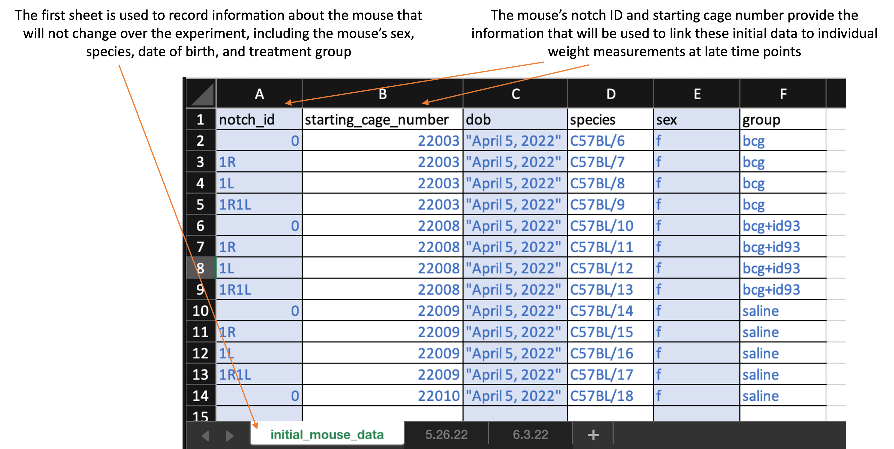
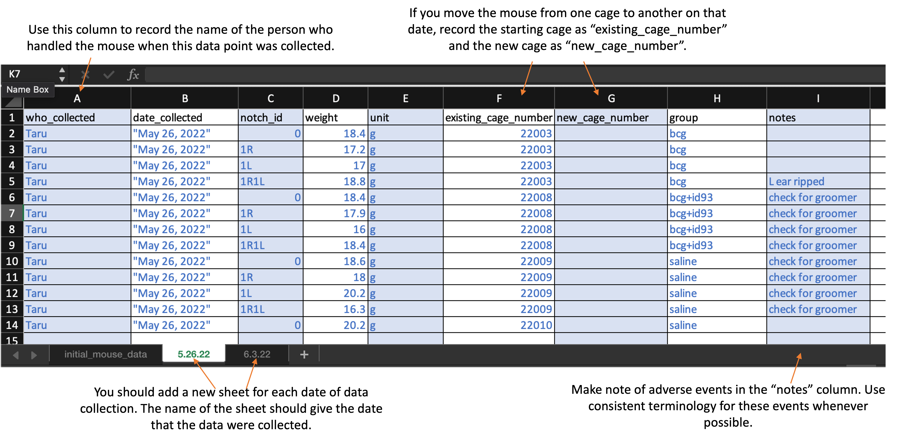

# Animal initial conditions and weekly weights 

### Overview

We use the template in this section to record information about each animal 
used in the experiment. This includes the species, sex, and experimental group.
It also includes some information to identify the animal, which in the case
of mice includes a code describing the pattern of notches put in the mouse's 
ear and the cage that the animal is assigned to at the beginning of the 
experiment. These are all values that can be determined at the start of the
experiment, when the mice are first assigned to groups.

This template is also used to record some data over the course of the
experiment. This includes adverse events and cases where an animal is moved from
one cage to another during the experiment.

In addition, in our experiments, we are measuring the mice every week to record
their weight over the course of the experiment. This weight measuring begins
before the first vaccination and continues through until the last mouse is
sacrificed. We have used ear notches to identify each mouse, and between the ear
notch and the mouse's cage number, we can uniquely track each mouse in the
study.

There are a few reasons that we are measuring these mouse weights. The first is
to help us manage the mice, particularly in terms of animal welfare. If there
are mice that are losing a lot of weight, that can be an indication that they
may need to be euthanized. For example, some animal care standards consider that
an adult animal that has lost 20% or more of its weight compared to its baseline
weight is indicating a clear sign of morbidity or suffering.

A second reason is that the weight measure might provide a record of each
mouse's general health over the course of the study. In the study, mice are
weighed in grams weekly to monitor clinical status, as one potential sign of 
tuberculosis infection and severity is weight loss. 

In humans, tuberculosis patients frequently display weight loss as a clinical
symptom associated with disease progression. In particular, extreme weight loss
and loss of muscle mass, also known as cachexia, can present as a result of
chronic inflammatory illnesses like tuberculosis [@baazim2022interplay]. This
cachexia is part of a systemic response to inflammation, and in humans has been
linked to upregulation of pro-inflammatory cytokines including tumor necrosis
factor, interleukin-6, and interferon-gamma [@baazim2022interplay].
Additionally, studies support a role in cachexia of key immune cell populations
such as cytotoxic T-cells which, when depleted, counteract muscle and fat
deterioration [@baazim2019cd8], suggest that thsi type of T-cells may
metabolically reprogram adipose tissue.

Given these relationships between weight loss, diseases, and immune processes, 
it is possible that mouse weight might provide a regularly measurable insight 
into the severity of disease in each animal. While many of data points 
are collected to measure the final disease state of each animal, fewer are 
available before the animal is sacrificed. We are hoping that mouse weights
will provide one measure that, while it may not perfectly capture disease 
severity, may provide some information throughout the experiment that is 
correlated to disease severity at regular time intervals.

Other studies that use a mouse model of tuberculosis have collected mouse
weights, as well [@smith2022host; @segueni2016controlled]. We plan to 
investigate these data to visualize the trajectory of weight gain / loss in 
each mouse both before and after they are challenged with tuberculosis. 
We also plan to test whether each mouse's weight change after challenge
is correlated with other metrics of the severity of disease and immune response.
We will do this by testing the correlation between the percent change in 
weight between challenge and sacrifice with CFUs at sacrifice as well as
expression of cytokines and other biological markers [@smith2022host].

### Template description

Both the animals' initial conditions and their weekly measures (adverse events,
cage changes, and weights) should be recorded in an excel worksheet. You can
download a copy of the template
[here](https://github.com/csu-impactb/CODING-TEAM-BOOKDOWN-/raw/main/templates/data_collection_templates/body_weights_template.xlsx).

The worksheet is divided into sheets. The first sheet is recorded at the first
time point when the mice are measured and is used to record information about
the mice that will remain unchanged over the course of the study, like species
and sex. Here is what the first sheet of the template looks like:

```{r echo = FALSE, out.width="100%"}

```

The second and later sheets are used to record the weight at each measured timepoint. 
The second sheet will record the weights on the first date they are measured, so 
it should be recorded at the same time as the first sheet---with initial mouse
information---is completed. Here is what the first sheet of the template looks like: 

```{r echo = FALSE, out.width="100%"}

```

As you continue to measure at new timepoints, you should add a sheet at each
timepoint, with each new sheet following the format of the second sheet in the
template. The second and later sheets should be labeled with the date when those
weights were measured (e.g., "5.26.22" for weights measured on May 26, 2022).

When you download the template, it will have example values filled out in blue.
Use these to get an idea for how to record your own data. When you are ready 
to record your own data, delete these example values and replace them with 
data collected from your own experiment. 

Column titles are as follows. First, in the first sheet, you will record: 

- `notch_id`: Record the ear notch pattern in the mouse. Make sure that you
record consistently across all timepoints, so that each mouse can be tracked
across dates. If you are doing single notches, for example, this might be "0"
for no notches, "1R" for one notch in the right ear, "1L" for one notch in the
left ear, and "1R1L" for one notch in each ear.
- `starting_cage_number`: Record the number of the cage that the mouse is put
into at the start of the experiment. In combination with the mouse's `notch_id`,
this will provide a unique identifier for each mouse at the start of the
experiment.
- `dob`: Record the date the mouse was born. 
- `species`: Record the species of the mouse (e.g., "C57BL/6" for C57 black 6 mice or 
"CBA" for CBA mice).
- `sex`: Record as "m" for male or "f" for female
- `group`: Provide the experimental group of the mouse. Be sure that you use the
same abbreviation or notation across each timepoint. Examples of group
designations might be: bcg, saline, bcg+id93, saline+id93, saline+noMtb

For the second and later sheets, you will record: 

- `who_collected`: Record the first name of the person who actually handled the mouse from the scale. 
- `date_collected`: Record the date using quotation marks, with the month, then day, then year. For example, "May 31, 2022".
- `weight`: Record as a number, without a unit in this column. The next column will be used for the units.	
- `unit`:	Provide the units that were used to take the weight (e.g., "g" for grams). Be consistent across all animals and timepoints in the abbreviation that you use (e.g., always use "g" for grams, not "g" sometimes and "grams" sometimes)
- `existing_cage_number`: Provide the cage number that the mouse is in when you start weighing at that time point. If the mouse is moved to another cage on this day, you will specify that in the next column. If the animal was moved from one cage to another between the last weighing and the date of the timepoint you are measuring, put in this column the cage number that the animal was in the last time it was weighed.
- `new_cage_number`: If the animal is moved to a new cage on the date of the timepoint you are measuring, then use this column to record the number of the cage you move it too. Similarly, if the animal moved cages between the last measured timepoint and this one, use this column to record the cage it was moved to. Otherwise, if the animal stays in the same cage that it was at the last measured time point, leave this column empty.
- `group`: Provide the experimental group of the mouse. Be sure that you use the same abbreviation or notation across each timepoint. Examples of group designations might be: bcg, saline, bcg+id93, saline+id93, saline+noMtb
- `notes`: Record information regarding clinical observations (e.g., "back is balding", "barbering", "excessive grooming", "euthanized"). 

### Processing collected data

Once data are collected, the file can be run through an R workflow. This workflow
will convert the data into a format that is easier to work with for data analysis
and visualization. It will also produce a report on the data in the spreadsheet, and 
ultimately it will also write relevant results in a format that can be used
to populate a global database for all experiments in the project. 

The next section provides the details of the pipeline. It aims to explain the 
code that processes the data and generates visualizations. You do not need to 
run this code step-by-step, but instead can access a script with the full 
code [here](https://raw.githubusercontent.com/csu-impactb/CODING-TEAM-BOOKDOWN-/main/templates/report_templates/animal_weights.Rmd). 

To use this reporting template, you need to download it to your computer, 
saving it in the file directory where you saved the data you collected with 
the data collection template. 


### Details of processing script

The first step in the workflow is to read in the data from the spreadsheet. 
As long as the data are collected following the template that was described
earlier, this code should be able to read it in correctly and create a 
master dataset with the data from all sheets of the spreadsheet. 

First, the workflow loads some additional R libraries. You may need to install 
these on your local R session if you do not already have them installed.

```{r message = FALSE, warning = FALSE}
library(readxl)
library(tidyverse)
```

Next, it uses a custom function to read in data from the spreadsheet. This
function (`read_mouse_weights`) creates a list of all of the sheets in the
spreadsheet, so it can be sure to read in all collected data. It creates
a list with each of the sheets with weekly weight measures, so it can 
read in each sheet in that list. Next, it reads in both the first sheet 
(with the initial mouse measures), as well as all the weight sheets.

```{r}
read_mouse_weights <- function(filepath) {
  
  # getting info about all excel sheets
  mouse_weights_sheets <- readxl::excel_sheets(filepath)[-1] # First sheet is initial data, not mouse weights
  
  mouse_weights <- purrr::map(mouse_weights_sheets, 
                              ~ readxl::read_excel(filepath, sheet = .x, 
                                                   col_types = c("text",   # who_collected
                                                                 "text",   # date_collected
                                                                 "text",   # notch_id
                                                                 "numeric", # weight
                                                                 "text",   # unit
                                                                 "text",   # existing_cage_number
                                                                 "text",   # new_cage_number
                                                                 "text",   # group
                                                                 "text"    # notes
                                                                 ))) %>% 
    dplyr::bind_rows() %>% 
    mutate(date_collected = lubridate::mdy(date_collected))

  return(mouse_weights)
}

# Use function to read in mouse weights from the sheet
# (we'll read in the initial information later)
our_mouse_weights <- read_mouse_weights(filepath = "DATA/body_weights_measurement.xlsx")
```

The next part of the processing is needed to track each mouse throughout the study. 
Some mice are moved from one cage to another. Often, this might be because the mice 
are fighting or otherwise show signs that they'd do better if separated. The 
researchers in the wet lab record the mouse information based on the cage the mouse 
is in at the start of the day that the measurement is taken, and they also record
if the mouse is moved to a new cage, specifically that new cage number. This code 
is using that information to create a unique ID for each mouse as it moves to 
different cages over the course of the study. 

```{r}
# Add a unique mouse ID. For right now, add it only for the first time point.
our_mouse_weights <- our_mouse_weights %>% 
  mutate(mouse_id = 1:n(), 
         mouse_id = ifelse(date_collected ==
                                    first(date_collected), 
                                  mouse_id, 
                                  NA))

# Function to get the next cage number based on the 
# existing cage number and notch ID. If the mouse does not
# switch cages again, the output is a vector of length 0
get_next_cage <- function(existing_cage_number, notch_id, 
                          df = our_mouse_weights){
  next_cage <- df %>% 
    filter(.data$existing_cage_number == {{existing_cage_number}} &
             .data$notch_id == {{notch_id}} & 
             !is.na(.data$new_cage_number)) %>% 
    pull(new_cage_number)
  
  return(next_cage)
}

# Function to get the full list of cages for each individual 
# mouse, over the course of all data collected to date
get_mouse_cages <- function(mouse_starting_cage, mouse_notch_id, 
                            df = our_mouse_weights){
  mouse_cage_list <- mouse_starting_cage
  i <- 1
  
  while(TRUE){
    next_cage <- get_next_cage(existing_cage_number =
                               mouse_cage_list[i],
                               notch_id = mouse_notch_id, 
                               df = df)
    if(length(next_cage) == 0) {
      break
      }
    i <- i + 1
    mouse_cage_list[i] <- next_cage
    }
  
  return(mouse_cage_list)
}

# Create a dataframe that lists all mice at the first time point, 
# as well as a list of all the cages they have been in over the
# experiment
mice_cage_lists <- our_mouse_weights %>% 
  filter(date_collected == first(date_collected)) %>% 
  select(notch_id, existing_cage_number, mouse_id) %>% 
  mutate(cage_list = map2(.x = existing_cage_number, 
                          .y = notch_id, 
                          .f = ~ get_mouse_cages(.x, .y, df = our_mouse_weights)))

# Add a column with the latest cage to the weight dataframe
our_mouse_weights$latest_cage <- NA

# Loop through all the individual mice, based on mice with a 
# measurement at the first time point. Add the unique ID for 
# each mouse, which will apply throughout the experiment. Also 
# add the most recent cage ID, so the mouse can be identified
# by lab members based on it's current location
for(i in 1:nrow(mice_cage_lists)){
  this_notch_id <- mice_cage_lists[i, ]$notch_id
  this_cage_list <- mice_cage_lists[i, ]$cage_list[[1]]
  this_unique_id <- mice_cage_lists[i, ]$mouse_id
  latest_cage <- this_cage_list[length(this_cage_list)]
  
  our_mouse_weights$mouse_id[our_mouse_weights$notch_id == this_notch_id & 
                       our_mouse_weights$existing_cage_number %in% 
                       this_cage_list] <- this_unique_id
  
  our_mouse_weights$latest_cage[our_mouse_weights$notch_id == this_notch_id & 
                       our_mouse_weights$existing_cage_number %in% 
                       this_cage_list] <- latest_cage
}

# Add a label for each mouse based on its notch_id and latest cage
our_mouse_weights <- our_mouse_weights %>% 
  mutate(mouse_label = paste("Cage:", latest_cage, 
                             "Notch:", notch_id))

our_mouse_weights
```

Now that the weekly weights are processed, the pipeline will read in and add the 
information that was calculated in the first sheet of the spreadsheet. This 
information is constant information for each mouse, like their sex, species, and 
experimental group. 

```{r}
mouse_initial <- readxl::read_excel("DATA/body_weights_measurement.xlsx", 
                                      sheet = 1, 
                                      col_types = c("text", # notch_id
                                                    "text", # starting_cage_number
                                                    "text", # dob
                                                    "text", # species
                                                    "text", # sex
                                                    "text" # group
                                                    )) %>%
  mutate(dob = lubridate::mdy(dob), 
         sex = forcats::as_factor(sex))

mouse_ids <- our_mouse_weights %>% 
  filter(date_collected == first(date_collected)) %>% 
  select(notch_id, existing_cage_number, mouse_id) %>% 
  rename(starting_cage_number = existing_cage_number)

mouse_initial <- mouse_initial %>% 
  left_join(mouse_ids, by = c("notch_id", "starting_cage_number"))

our_mouse_weights <- our_mouse_weights %>% 
  left_join(mouse_initial, by = c("mouse_id", "notch_id", "group"))
```


```{r}
# Explore this data a bit
our_mouse_weights %>% 
  ggplot(aes(x = date_collected, y = weight, 
             group = mouse_id, color = sex)) + 
  geom_line() + 
  facet_wrap(~ group)

our_mouse_weights %>% 
  ggplot(aes(x = date_collected, y = weight, color = who_collected)) + geom_point()

library(ggbeeswarm)
our_mouse_weights %>% 
  filter(date_collected == last(date_collected)) %>% 
  ggplot(aes(x = group, y = weight)) + 
  geom_beeswarm(aes(color = sex)) + 
  geom_boxplot(fill = NA, color = "dodgerblue")

write_csv(our_mouse_weights, "DATA/example_mouse_output.csv")
```


