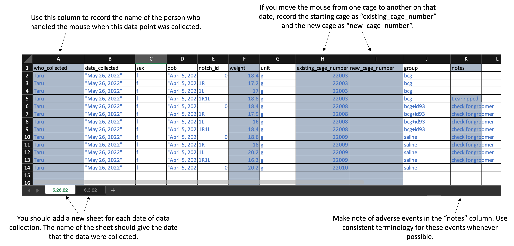

# Mouse Weights

### Overview

Extreme weight loss and loss of muscle mass, also known as cachexia, typically presents along side chronic inflammatory illnesses like Tuberculosis disease [@baazim2022interplay]. We now recognize that cachexia is part of a systemic response to inflammation, and has been linked to upregulation of pro-inflammatory cytokines such as TNF, IL-6, and IFNg in humans [@baazim2022interplay]. Additionally, studies support the role of key immune cell populations such as CD8+ T-cells that, when depleted, counteract muscle and fat deterioration  [@baazim2019cd8],  and suggest that CD8+ T-cells may metabolically reprogram adipose tissue.

In recognition of cachexia related illnesses and diseases, we tracked the progression of weight loss over the course of this study, as is done with many TB-mouse studies [@smith2022host; @segueni2016controlled]. These data is also useful when correlating to CFU count as well as expression of cytokines and other biological markers [@smith2022host]. Here, mice are weighed in grams weekly to monitor clinical status as TB patients frequently display weight loss as clinical symptom associated with disease progression. 

The following contains information about how the data was collected, organized, and curated for analysis in RStudio.

### Template description

Weights should be recorded in an excel worksheet. You can download a copy of the
template [here](https://github.com/csu-impactb/CODING-TEAM-BOOKDOWN-/raw/main/DATA/body_weights_template.xlsx). Here is what the template looks like: 

```{r echo = FALSE}

```


When you download the template, it will have example values filled out in blue.
Use these to get an idea for how to record your own data. When you are ready 
to record your own data, delete these example values and replace them with 
data collected from your own experiment. 

Column titles are as follows:

- `who_collected`: Record the first name of the person who actually handled the mouse from the scale. 
- `date_collected`: Record the date using quotation marks, with the month, then day, then year. For example, "May 31, 2022".
- `sex`: Record as "m" for male or "f" for female
- `notch_id`: Record the ear notch pattern in the mouse. Make sure that you record consistently across all timepoints, so that each mouse can be tracked across dates. If you are doing single notches, for example, this might be "0" for no notches, "1R" for one notch in the right ear, "1L" for one notch in the left ear, and "1R1L" for one notch in each ear.
- `mouse_number`: Record as a number identifying mice within a cage. This should be consistent across all recorded timepoints (i.e., the mouse in a cage with ear notch "1L" might be given the number "1"; if so, its number should always be recorded in this column as "1"). This number will repeat across different cages, but if you combine this number with the cage number, it gives a unique identifier for each mouse in the study. 
- `weight`: Record as a number, without a unit in this column. The next column will be used for the units.	
- `unit`:	Provide the units that were used to take the weight (e.g., "g" for grams). Be consistent across all animals and timepoints in the abbreviation that you use (e.g., always use "g" for grams, not "g" sometimes and "grams" sometimes)
- `existing_cage_number`: Provide the cage number that the mouse is in when you start weighing at that time point. If the mouse is moved to another cage on this day, you will specify that in the next column. If the animal was moved from one cage to another between the last weighing and the date of the timepoint you are measuring, put in this column the cage number that the animal was in the last time it was weighed.
- `new_cage_number`: If the animal is moved to a new cage on the date of the timepoint you are measuring, then use this column to record the number of the cage you move it too. Similarly, if the animal moved cages between the last measured timepoint and this one, use this column to record the cage it was moved to. Otherwise, if the animal stays in the same cage that it was at the last measured time point, leave this column empty.
- `group`: Provide the experimental group of the mouse. Be sure that you use the same abbreviation or notation across each timepoint. Examples of group designations might be: bcg, saline, bcg+id93, saline+id93, saline+noMtb
- `notes`: Record information regarding clinical observations (e.g., "back is balding", "barbering", "excessive grooming", "euthanized"). 

good reference: https://elifesciences.org/articles/74419#s4

```{r message = FALSE, warning = FALSE}
library(readxl)
library(tidyverse)
```

### Read in data

Data is stored in one excel sheet, each week is one sheet named as the date -> return vector for each sheet name 

```{r}
weight_data <- read_xlsx("DATA/body_weights_measurement.xlsx")
excel_sheets("DATA/body_weights_measurement.xlsx") #lists names of each sheet

read_mouse_weights <- function(filepath) {
  
  # getting info about all excel sheets
  mouse_weights_sheets <- readxl::excel_sheets(filepath)
  mouse_weights <- purrr::map(mouse_weights_sheets, 
                              ~ readxl::read_excel(filepath, sheet = .x, 
                                                   col_types = c("text",   # who_collected
                                                                 "text",   # date_collected
                                                                 "text",   #  sex
                                                                 "text",   # dob
                                                                 "text",   # notch_id
                                                                 "numeric", # weight
                                                                 "text",   # unit
                                                                 "text",   # existing_cage_number
                                                                 "text",   # new_cage_number
                                                                 "text",   # group
                                                                 "text"    # notes
                                                                 ))) %>% 
    dplyr::bind_rows() %>% 
    mutate(date_collected = lubridate::mdy(date_collected), 
           dob = lubridate::mdy(dob), 
           sex = forcats::as_factor(sex))

  return(mouse_weights)
}

# Test function
ex <- read_mouse_weights(filepath = "DATA/body_weights_measurement.xlsx")
```

```{r}
# Add a unique mouse ID, starting with just the first time point
ex <- ex %>% 
  mutate(mouse_id = 1:n(), 
         mouse_id = ifelse(date_collected ==
                                    first(date_collected), 
                                  mouse_id, 
                                  NA))

# Function to get the next cage number based on the 
# existing cage number and notch ID. If the mouse does not
# switch cages again, the output is a vector of length 0
get_next_cage <- function(existing_cage_number, notch_id, 
                          df = ex){
  next_cage <- df %>% 
    filter(.data$existing_cage_number == {{existing_cage_number}} &
             .data$notch_id == {{notch_id}} & 
             !is.na(.data$new_cage_number)) %>% 
    pull(new_cage_number)
  
  return(next_cage)
}

# Function to get the full list of cages for each individual 
# mouse, over the course of all data collected to date
get_mouse_cages <- function(mouse_starting_cage, mouse_notch_id, 
                            df = ex){
  mouse_cage_list <- mouse_starting_cage
  i <- 1
  
  while(TRUE){
    next_cage <- get_next_cage(existing_cage_number =
                               mouse_cage_list[i],
                               notch_id = mouse_notch_id, 
                               df = df)
    if(length(next_cage) == 0) {
      break
      }
    i <- i + 1
    mouse_cage_list[i] <- next_cage
    }
  
  return(mouse_cage_list)
}

# Create a dataframe that lists all mice at the first time point, 
# as well as a list of all the cages they have been in over the
# experiment
mice_cage_lists <- ex %>% 
  filter(date_collected == first(date_collected)) %>% 
  select(notch_id, existing_cage_number, mouse_id) %>% 
  mutate(cage_list = map2(.x = existing_cage_number, 
                          .y = notch_id, 
                          .f = ~ get_mouse_cages(.x, .y, df = ex)))

# Add a column with the latest cage to the weight dataframe
ex$latest_cage <- NA

# Loop through all the individual mice, based on mice with a 
# measurement at the first time point. Add the unique ID for 
# each mouse, which will apply throughout the experiment. Also 
# add the most recent cage ID, so the mouse can be identified
# by lab members based on it's current location
for(i in 1:nrow(mice_cage_lists)){
  this_notch_id <- mice_cage_lists[i, ]$notch_id
  this_cage_list <- mice_cage_lists[i, ]$cage_list[[1]]
  this_unique_id <- mice_cage_lists[i, ]$mouse_id
  latest_cage <- this_cage_list[length(this_cage_list)]
  
  ex$mouse_id[ex$notch_id == this_notch_id & 
                       ex$existing_cage_number %in% 
                       this_cage_list] <- this_unique_id
  
  ex$latest_cage[ex$notch_id == this_notch_id & 
                       ex$existing_cage_number %in% 
                       this_cage_list] <- latest_cage
}

# Add a label for each mouse based on its notch_id and latest cage
ex <- ex %>% 
  mutate(mouse_label = paste("Cage:", latest_cage, 
                             "Notch:", notch_id))

ex
```

```{r}
# Explore this data a bit
ex %>% 
  ggplot(aes(x = date_collected, y = weight, 
             group = mouse_id, color = sex)) + 
  geom_line() + 
  facet_wrap(~ group)

ex %>% 
  ggplot(aes(x = date_collected, y = weight, color = who_collected)) + geom_point()

library(ggbeeswarm)
ex %>% 
  filter(date_collected == last(date_collected)) %>% 
  ggplot(aes(x = group, y = weight)) + 
  geom_beeswarm(aes(color = sex)) + 
  geom_boxplot(fill = NA, color = "dodgerblue")

write_csv(ex, "DATA/example_mouse_output.csv")
```


