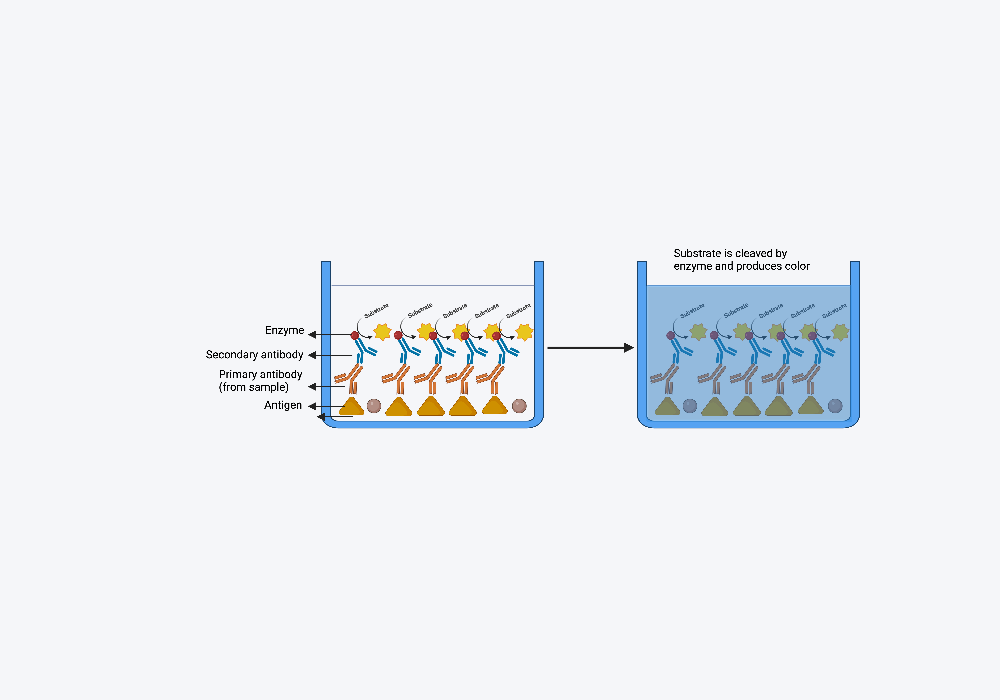

---
output:
  pdf_document: default
  html_document: default
editor_options:
  chunk_output_type: console
---
# Enzyme-linked immunosorbest assay (ELISA)

ELISA is a standard molecular biology assay for detecting and quantifying a 
variety of compounds, including peptides, proteins, and antibodies in a sample.
The sample could be serum, plasma, or bronchoalveolar lavage fluid (BALF).

## **Importance of ELISA**

An antigen-specific reaction in the host results in the production of antibodies, which are proteins found in the blood. In the event of an infectious disease, 
it aids in the detection of antibodies in the body. ELISA is distinguishable from other antibody-assays in that it produces quantifiable findings and separates non-specific from specific interactions by serial binding to solid surfaces, 
which is often a polystyrene multi-well plate.

In IMPAc-TB project, it is crucial to evaluate the if the vaccine is eliciting humoral immunity and generating antibodies against vaccine antigen. ELISA will 
be used to determine the presence of Immunoglobulin (Ig) IgG, IgA, and IgM in 
the serum different time points post-vaccination. 

### **Principle of ELISA**

ELISA is based on the principle of antigen-antibody interaction. An antigen must be immobilized on a solid surface and then complexed with an enzyme-linked antibody in an ELISA. The conjugated enzyme's activity is evaluated by incubating it with a substrate to yield a quantifiable result, which enables detection. There are four basic steps of ELISA:

**1. Coating multiwell plate with antigen/antibody**: This step depends on what we want to detect the sample. If we need to evaluate the the presence of antibody, the plate will be coated with the antigen, and vice versa. To coat the plate, a fixed concentration of antigen (protein) is added to a 96 well high-binding plate (charged plate). Plate is incubated over night with the antigen at 4 degree celsius (as proteins are temperature sensitive) so that antigens are completely bound to the well. 

**2. Blocking**: It is possible that not each and every site of the well is coated with the targeted antigen, and there could be uncovered areas. It is important to block those empty spaces so that primary antibody (which we will add to the next step) binds to these spaces and give us false positive results. For this, microplate well surface-binding sites are blocked with an unrelated protein or other substance.Most common blocking agents are bovine serum albumin, skim milk, and casein. One of the best blocking agents is to use the serum from the organism in which your secondary (detection antibody) is raised. For example, if the secondary antibody is raised in goat, then we can use goat serum as a blocking agent. 

**3. Probing**: Probing is the step where we add sample containing antibodies that we want to detect. This will be the primary antibody. If the antibodies against the antigen (which we have coated) are present in the sample, it will bind to the antigen with high affinity. 

**4. Washing**: After the incubation of sample containing primary antibody, the wells are washed so that any unbound antibody is washed away. Washing solution contains phosphate buffer saline + 0.05% tween-20 (a mild detergent). 0.05% tween-20 washes away all the non-specific interactions as those are not strong, but keeps all the specific interaction as those are strong and cannot be detached with mild detergent. 

**5. Detection**: To detect the presence of antibody-antigen complex, a secondary antibody labelled with an enzyme (usually horseradish peroxidase) is added to the wells, incubated and washed. 

**6. Signal Measurement**: Finally to detect "if" and "how much" of the antibody is present, a chromogenic substrate (like 3,3',5,5'-Tetramethylbenzidine) is added to the wells, which can be cleaved the the enzyme that is tagged to the secondary antibody. The color compund is formed after the addition of the substrate, which is directly proportional to the amount of antibody present in the sample. The plate is read on a plate reader, where color is converted to numbers. 

```{r pressure, echo=FALSE, fig.cap="A caption", out.width = '100%'}

```

### Loading libraries

```{r}
library(readxl)
library(tidyverse)
library(minpack.lm)
library(broom)
library(purrr)
library(ggbeeswarm)
```


## ELISA data analysis

Analysis of ELISA data is the most important part of the ELISA experiment. ELISA data can be analyzed in different ways based on how the data is acquired. There are a a few examples of the type of ELISA data :

**1. With standard curve:** ELISA can be used to determine the concentrations of the antigen and antibody. This type of ELISA data usually have a standard curve with
different concentrations of the known analyte and the concentration in the sample is determined by extrapolating the unknown values in the curve. This type of assay is straightforward, easy to interpret and are more robust.

**2. Without standard curve:** Usually vaccine studies involve investigating the presence of high-affinity (and novel) antibodies against the vaccine antigens. 
Therefore, plotting a standard curve is not feasible as there is no previous information available for antibody concentration or type of antibody. Also, because antibody response to a vaccine will differ depending on the individual, 
it is not practical to generate a calibration curve from which absolute concentrations can be extrapolated.
For this type of ELISA, quantification of the antibody titers is performed using serial dilutions of the test samples, and analysis can be performed using the  following three methods [@hartman2018absorbance]:

1. Fitting sigmoid model
2. Endpoint titer method
3: Absorbance summation method

Let's have a look at these methods, how we can apply these methods in our data, and R-based packages that we can utilize to perform this analysis.

## **1. Curve fitting model:** 

The curve in ELISA data represents a plot of known concentrations versus their corresponding signal responses. The typical range of these calibration curves is one to two orders of magnitude on the response axis and two or more orders of magnitude on the concentration axis. The real curve of each assay could be easily identified if an infinite number of concentration dilutions with an infinite number of repetitions could be tested. The correct curve must be approximated from a relatively small number of noisy points, though, because there are a finite number of dilutions that may be performed. To estimate the dose-response relationship between standard dilutions, a method of interpolating between standards is required because there cannot be a standard at every concentration. This process is typically performed using a mathematical function or regression to approximate the true shape of the curve. A curve model is the name given to this approximating function, which commonly uses two or more parameters to describe a family of curves, and are then adjusted in order to find the curve from the family of curves that best fits the assay data. 

Three qualities should be included in a good curve fitting model. 
1. The true curve's shape must be accurately approximated by the curve model. If the curve model does not accomplish this, there is no way to adjust for this component of the total error that results from a lack of fit. 
2. In order to get concentration estimates with minimal inaccuracy, a decent curve model must be able to average away as much of the random variation as is practical. 3. A successful curve model must be capable of accurately predicting concentration values for points between the anchor points of the standard dilutions. 

### How do we perform curve fitting model
There are two major steps in performing curve fitting model for non-linear data like ELISA:
1. Finding the initial starting estimates of the parameters
2. locating the optimal solution in a region of the initial estimates

We have presented an example below where we have performed a 8-10 point serial dilution of our sample and fitted a 4 parameter curve model. 

### An example of the curve fitting model

#### Read in the data

This information comes from the 2018 study conducted by Hartman et al. Hartman et al. analyzed the ELISA data in their study utilizing fitted sigmoid analysis, end point titer, and absorbance summation. We utilized this information to determine whether our formulas and calculations provide the same outcomes and values as theirs.

```{r}
elisa_example_data <- read_excel("DATA/example_elisa_data.xlsx")
```

#### Tidying the data

We next performed tidying the data and make it in a format so that we can plot a sigmoid curve with that. 

```{r}
# Divide dilution column into two seoparate columns

elisa_example_data <- separate(elisa_example_data, 
                               col = "dilution", 
                               into = c("numerator", "denominator"), 
                               sep = "\\/")

# Convert the tabke from character to numeric
elisa_example_data <- elisa_example_data %>% 
  mutate_if(is.character, as.numeric)


elisa_example_data$dilution <- 
  elisa_example_data$numerator/elisa_example_data$denominator  

elisa_example_data <- elisa_example_data %>%
  mutate(log_dilution = log(dilution, base = 3))

head(elisa_example_data)

```

#### Create function for curve fitting model

We next created the curve fitting model function by using nlsLM function from "minpack.lm" package. 
The purpose of nlslm is to minimize the sum square of the vector returned by the function fn, by a modification of the Levenberg-Marquardt algorithm. In the early 1960s, the Levenberg-Marquardt algorithm was developed to address nonlinear least squares problems. Through a series of well-chosen updates to model parameter values, Levenberg-Marquardt algorithm lower the sum of the squares of the errors between the model function and the data points.

```{r}
mod_1 <- nlsLM(absorbance ~ 
                 ((a-d)/(1+(log_dilution/c)^b)) + d,
data = elisa_example_data, 
start = list (a = 4, d= 0, c = -5, b = 1))

# a = maximum absorbance
# d = minimum absobance
# c = point of maximum growth 
# b = slope at c

mod_1

summary(mod_1)
```

#### Apply the function to the data
```{r}
tidy_params <- mod_1 %>% tidy() 

a <- tidy_params$estimate[tidy_params$term == "a"]
b <- tidy_params$estimate[tidy_params$term == "b"]
c <- tidy_params$estimate[tidy_params$term == "c"]
d <- tidy_params$estimate[tidy_params$term == "d"]

elisa_example_data <- elisa_example_data %>%
  mutate(fitted = predict(mod_1))

elisa_example_data <- elisa_example_data %>%
  mutate(fitted = predict(mod_1))
```

#### Plot the sigmoid curve with fitted sigmoid model
```{r}
elisa_example_data %>%
  ggplot(aes(x = log_dilution, y = absorbance)) +
  geom_point() +
  geom_line(aes(y=fitted), color = "dodgerblue")
```

## 2. Endpoint titer method

The endpoint titer approach chooses an absorbance value just above the background noise (or the lower asymptotic level). **The highest dilution with an absorbance greater than this predetermined value is the endpoint titer.** This method is based on the assumption that a sample with a higher protein concentration will require a higher dilution factor to achieve an absorbance just above the level of background noise.

### Create an endpoint titer function and apply it to the output of the fitted sigmoid model values.

```{r}
endpoint_titer <- c * (((a - d) / (0.2 - d)) - 1) ^ (1 / b)

summary(endpoint_titer)

endpoint_titer

```

### Other methods to analyze ELISA data

#### Absorption summation
#### Area under the curve

In this model of data analysis, we sum all the absorbance values from each sample to obtain one value. This value is termed as absorption summation (AS). Using the above data, the AS will be calculated as below:

```{r}
AS = 0.04 + 0.04 + 0.05 + 0.05 + 0.06 + 
  0.1 + 0.22 + 0.51 + 1.1 + 2.34 + 3.73 + 4.0

AS

```

## Apply the fitting sigmoid model and endpoint titer function in our dataset

The presented data is from a mouse study. In this data, presence of IgG antibody has been evaluated against receptor binding domain (RBD) of SARS-CoV-2 virus in two different groups of mice. We need to elucidate which group has higher concentration of the antibodies. 

#### Read in the data

```{r}
elisa_data <- read_excel("DATA/elisa_data_serial_dilution.xlsx")
```

#### Tidy the data

```{r}

elisa_data <- pivot_longer(data = elisa_data, 
                           cols = "Mouse_1":"Mouse_5", 
                           names_to = "mouse_id", 
                           values_to = "absorbance")

head(elisa_data)

# separate dilution column and convert it to log2

elisa_data <- separate(elisa_data, 
                       col = "Dilution", 
                       into = c("numerator", 
                                "denomenator"), 
                       sep = "\\/")

elisa_data <- elisa_data %>% 
  transform(numerator = as.numeric(numerator),
            denomenator = as.numeric(denomenator))

elisa_data <- elisa_data %>%
  mutate(dilution = 
           elisa_data$numerator/elisa_data$denomenator) 

elisa_data <- elisa_data %>%
  mutate(log_dilution = log2(dilution))

head(elisa_data)

```

##### converting data into dataframe
```{r}
elisa_data_df <- elisa_data %>% 
  group_by(Groups, mouse_id) %>% 
  summarize(log_dilution = log_dilution, 
            absorbance = absorbance)

elisa_data_nested <- elisa_data %>%
  group_by(Groups, mouse_id) %>%
  nest()

head(elisa_data_nested)

```

##### plot the curves to evaluate the a, d, c, and b
```{r fig.width= 8, fig.height= 8, fig.align="center"}

elisa_data %>%
  ggplot(aes(x = log_dilution, y = absorbance)) +
  geom_point() +
  geom_line() + 
  facet_wrap(Groups ~ mouse_id)
```

Based on the curve, the values are: 

a = 4, 
d = 0
c = 2
b = 1

### Creating a function for fitting model 
```{r}

fitted_model_elisa <- function(df_elisa, 
                               start_a, start_d, 
                               start_c, start_b) {
  mod_1 <- nlsLM(absorbance ~ 
                   ((a-d)/(1+(log_dilution/c)^b)) + d,
data = df_elisa,
start = list(a = start_a, d = start_d, c = start_c, b = start_b))
  return(mod_1)
}
```

#### Fitting the model into the dataset

```{r}
fitted_model_elisa(elisa_data_nested$data[[1]], 
                   start_a = 4, 
                   start_d = 0, 
                   start_c = -8, 
                   start_b = 1)
```

#### Apply the fitted model function to the whole dataframe

```{r}

elisa_fitted_data <- elisa_data_nested %>%
  mutate(fitted_data = 
           purrr::map(data, ~ 
                        fitted_model_elisa(.x,start_a = 4, 
                                              start_d = 0, 
                                              start_c = -8, 
                                              start_b = 1)))

head(elisa_fitted_data)
```

#### Take out the summary of the data

```{r}
elisa_fitted_data_summary <- elisa_fitted_data %>%
  mutate(elisa_fitted_data_summary = 
           purrr::map(fitted_data, broom::glance))

unnested <- elisa_fitted_data_summary %>%
unnest(elisa_fitted_data_summary) %>%
ungroup() %>%
dplyr::select(Groups, mouse_id, fitted_data)

unnested$fitted_data[[1]]

```

## Create function of Fitted model and endpoint titer, where the output of the fitted model data will be the input of the endpoint titer

```{r}
# Fitted model function
fitted_model_elisa <- function(df_elisa, 
                               start_a, 
                               start_d, 
                               start_c, 
                               start_b) {
  mod_1 <- nlsLM(absorbance ~ 
                   ((a-d)/(1+(log_dilution/c)^b)) + d,
data = df_elisa,
start = list(a = start_a, d = start_d, c = start_c, b = start_b))
  return(mod_1)
}

# Endpoint titer function

endpoint_titer_elisa <- function(fitted_data, back_value) {
  tidy_fitted <- broom::tidy(fitted_data)
  est_a <- tidy_fitted$estimate[tidy_fitted$term == "a"]
  est_b <- tidy_fitted$estimate[tidy_fitted$term == "b"]
  est_c <- tidy_fitted$estimate[tidy_fitted$term == "c"]
  est_d <- tidy_fitted$estimate[tidy_fitted$term == "d"]
  endpoint_titer <- est_c * (((est_a - est_d) / (back_value - est_d)) - 1) ^ (1 / est_b)
  return(endpoint_titer)
}
```

#### Apply the fitted model fuction into the nested data and use the output of the fitted data as the input for endpoint titer value evaluation

##### Run fitted model on the data
```{r}
elisa_data_with_fit_model <- elisa_data_nested %>%
  mutate(fitted_data = purrr::map(data, 
                                  ~ fitted_model_elisa(.x, start_a = 4, 
                                                          start_d = 0, 
                                                          start_c = -8, 
                                                          start_b = 1)))

head(elisa_data_with_fit_model)
```

##### Taking output of the fitted model function and into endpoint titer function

```{r}
elisa_data_with_endpoint_titer <- elisa_data_with_fit_model %>%
  mutate(endpoint_data = 
           purrr::map(fitted_data, 
                      ~ endpoint_titer_elisa(.x, back_value = 0.2)))
```

#### Plot the endpoint titer data for the two groups

```{r}

elisa_data_with_endpoint_titer$endpoint_data=
  as.numeric(elisa_data_with_endpoint_titer$endpoint_data)

elisa_data_with_endpoint_titer %>%
  ggplot(aes(x = Groups, y = endpoint_data, color = Groups)) +
 geom_beeswarm(cex = 3) 
```

#### Perform statistical analysis on the data

```{r}
elisa_data_stats <- t.test(endpoint_data ~ Groups, 
                           data = elisa_data_with_endpoint_titer)

elisa_data_stats %>%
  tidy()
```

#### Statistical data analysis for more than two groups


## ELISA data processing

We read ELISA plate in a 96 well plate using a plate reader. The plate reader generates the data in form of number in an excel sheet. We have created this pipeline/worksheet to bring out the information from the excl sheet to a tidy format in which the above created fitted model and endpoint titer functions can be applied. 

#### Read in the first dataset
Below is the example ELISA data that has came straight out of the plate reader. This data is arranged in a 96-well plate format and contains Optical Density (OD) values.

```{r}
elisa_raw_data <- read_excel("DATA/elisa_s1_07-25-20.xlsx", 
                             sheet = "S1", col_names = FALSE,  
                             range = "B2:M9")


head(elisa_raw_data)
```

#### Tidy dataset 1
It is important to clean the data and arrange it in a format on which we can apply formulas and functions. 

```{r}
# Convert all columns to numeric

elisa_raw_data_numeric <- elisa_raw_data %>% 
  mutate_if(is.character, as.numeric)

# pivot longer the data

elisa_raw_data_tidy <- pivot_longer(data = elisa_raw_data_numeric, cols = "...1":"...12", names_to = "well_id", values_to = "od_450nm")

# remove "..." from the first column

elisa_raw_data_tidy$well_id <- str_replace(elisa_raw_data_tidy$well_id, "...", "")

# Add new column to the data_frame

elisa_raw_data_tidy_new <- elisa_raw_data_tidy %>%
  mutate(name = rep(LETTERS[1:8], each = 12))

elisa_raw_data_tidy_new <- elisa_raw_data_tidy_new %>%
  mutate(well_id = paste0(name, well_id)) %>%
  select(-name)

head(elisa_raw_data_tidy_new)

```

#### Read in the second data set
The second dataset contains the information such as groups, mouse id, and dilutions for the respective wells of the 96 well plate for the dataset-1. 

```{r}
elisa_label_data <- read_excel("DATA/elisa_s1_07-25-20.xlsx", 
                               sheet = "S1", col_names = FALSE,  
                               range = "Q2:AB9")

head(elisa_label_data)
```

#### Tidy dataset-2
```{r}
# pivot longer the data

elisa_label_data_tidy <- pivot_longer(data = elisa_label_data, 
                                      cols = "...1":"...12", 
                                      names_to = "well_id", 
                                      values_to = "information")

# remove "..." from the first column

elisa_label_data_tidy$well_id <- str_replace(elisa_label_data_tidy$well_id, "...", "")

# Add new column to the data_frame

elisa_label_data_tidy_new <- elisa_label_data_tidy %>%
  mutate(name = rep(LETTERS[1:8], each = 12))

elisa_label_data_tidy_new <- elisa_label_data_tidy_new %>%
  mutate(well_id = paste0(name, well_id)) %>%
  select(-name)

head(elisa_label_data_tidy_new)
```

#### Merge dataset-1 (with OD information) with dataset-2 (with respective data information)
To create a complete full dataset with Groups, mouse-id, dilutions, and OD, we merged the dataset-1 and dataset-2 together. We also cleaned the data set so that mouse-ID and dilution columns are separate and have their own columns. 

```{r}
#Merge the two datasets

elisa_data = elisa_raw_data_tidy_new %>% inner_join(elisa_label_data_tidy_new,
                                                    by="well_id")

head(elisa_data)

### Separate the information table into sample ID and dilution columns

tidy_elisa_data <- separate(elisa_data, col = "information", 
                            into = c("sample_id", "dilution"),
                            sep = "\\(")

head(tidy_elisa_data)
```
```{r}
tidy_elisa_data <- tidy_elisa_data %>%
  mutate(dilution = str_extract(dilution, "(/)[0-9]+"),
         dilution = str_replace(dilution, "/", ""),
         dilution = as.numeric(dilution))

tidy_elisa_data <- tidy_elisa_data %>%
  select(well_id, sample_id, dilution, od_450nm)

head(tidy_elisa_data)

```
