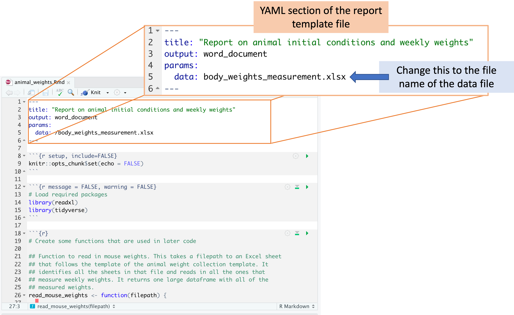
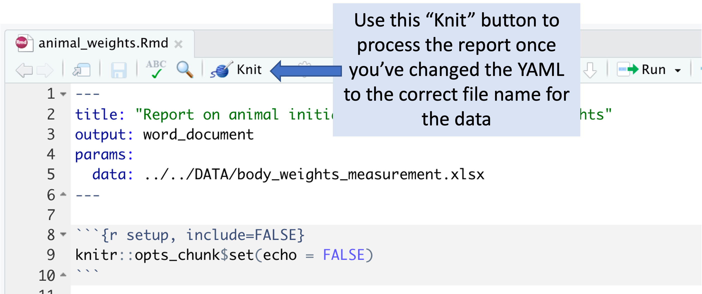

--- 
title: "ImpactTB/BAA: Standard Operating Procedures for Data Analysis"
author: "Colorado State University Coding Team"
date: "`r Sys.Date()`"
site: bookdown::bookdown_site
output: bookdown::gitbook
documentclass: book
bibliography: [book.bib, packages.bib]
biblio-style: apalike
link-citations: yes
github-repo: rstudio/bookdown-demo
description: "A comprehensive guide to wet lab data collection, sample processing, and computational tool creation for robust and efficient data analysis and dissemination."
---

# Overview

## About the project

The objective of the Immune Mechanisms of Protection against Mycobacterium tuberculosis (IMPAc-TB) program is to get a thorough understanding of the immune responses necessary to avoid initial infection with *Mycobacterium tuberculosis (Mtb)*, formation of latent infection, and progression to active TB illness. To achieve these goals, the National Institute of Allergy and Infectious Diseases awarded substantial funding and established multidisciplinary research teams that will analyze immune responses against *Mtb* in animal models (mice, guinea pigs, and non-human primates) and humans, as well as immune responses elicited by promising vaccine candidates. The contract awards establish and give up to seven years of assistance for IMPAc-TB Centers to explain the immune responses required for *Mtb* infection protection. 

The seven centers that are part of the study are (in alphabetical order):

1. Colorado State University
2. Harvard T.H. Chan School of Public Health
3. Seattle Children Hospital
4. [more]


Colorado State University Team and role of each member:

- Dr. Marcela Henao-Tamayo: Principal Investigator
- Dr. Brendan Podell: Principal Investigator
- Dr. Andres Obregon-Henao: Research Scientist-III
- Dr. Taru S. Dutt: Research Scientist-I
- [more]

## About this book

The aim of this book is to provide data protocols and data collection templates
for key types of data that are collected over the course of this project. By using
standard templates to record data, as well as starting from defined pipelines to 
process and analyze the data, we aim to standardize the collection and processing
of data across this project. 

Here, we have built a comprehensive guide to wet lab data collection, sample processing, and computational tool creation for robust and efficient data analysis and dissemination.

```{r include=FALSE}
# automatically create a bib database for R packages
knitr::write_bib(c(
  .packages(), 'bookdown', 'knitr', 'rmarkdown'
), 'packages.bib')
```

<!--chapter:end:index.Rmd-->

# Experimental metadata

Metadata for an experiment: 

- `species`
- `start_date`
- `end_date`
- `experimental_groups`


<!--chapter:end:01-metadata.Rmd-->

# Animal initial conditions and weekly weights 

### Downloads

The downloads for this chapter are: 

- [Data collection template](https://github.com/csu-impactb/CODING-TEAM-BOOKDOWN-/raw/main/templates/data_collection_templates/body_weights_template.xlsx) for collecting initial information about the experimental animals and regular weight measurements, cage changes, and adverse events throughout the experiment
- [Report template](https://raw.githubusercontent.com/csu-impactb/CODING-TEAM-BOOKDOWN-/main/templates/report_templates/animal_weights.Rmd) to process data collected with the template (when you go to this link, go to the "File" bar in your browser's menu bar, chose "Save As", then save the file as "animal_weights.Rmd")
- [Example output](https://github.com/csu-impactb/CODING-TEAM-BOOKDOWN-/raw/main/templates/report_templates/animal_weights.docx) from the report template

### Overview

We use the template in this section to record information about each animal 
used in the experiment. This includes the species, sex, and experimental group.
It also includes some information to identify the animal, which in the case
of mice includes a code describing the pattern of notches put in the mouse's 
ear and the cage that the animal is assigned to at the beginning of the 
experiment. These are all values that can be determined at the start of the
experiment, when the mice are first assigned to groups.

This template is also used to record some data over the course of the
experiment. This includes adverse events and cases where an animal is moved from
one cage to another during the experiment.

In addition, in our experiments, we are measuring the mice every week to record
their weight over the course of the experiment. This weight measuring begins
before the first vaccination and continues through until the last mouse is
sacrificed. We have used ear notches to identify each mouse, and between the ear
notch and the mouse's cage number, we can uniquely track each mouse in the
study.

There are a few reasons that we are measuring these mouse weights. The first is
to help us manage the mice, particularly in terms of animal welfare. If there
are mice that are losing a lot of weight, that can be an indication that they
may need to be euthanized. For example, some animal care standards consider that
an adult animal that has lost 20% or more of its weight compared to its baseline
weight is indicating a clear sign of morbidity or suffering.

A second reason is that the weight measure might provide a record of each
mouse's general health over the course of the study. In the study, mice are
weighed in grams weekly to monitor clinical status, as one potential sign of 
tuberculosis infection and severity is weight loss. 

In humans, tuberculosis patients frequently display weight loss as a clinical
symptom associated with disease progression. In particular, extreme weight loss
and loss of muscle mass, also known as cachexia, can present as a result of
chronic inflammatory illnesses like tuberculosis [@baazim2022interplay]. This
cachexia is part of a systemic response to inflammation, and in humans has been
linked to upregulation of pro-inflammatory cytokines including tumor necrosis
factor, interleukin-6, and interferon-gamma [@baazim2022interplay].
Additionally, studies support a role in cachexia of key immune cell populations
such as cytotoxic T-cells which, when depleted, counteract muscle and fat
deterioration [@baazim2019cd8], suggest that thsi type of T-cells may
metabolically reprogram adipose tissue.

Given these relationships between weight loss, diseases, and immune processes, 
it is possible that mouse weight might provide a regularly measurable insight 
into the severity of disease in each animal. While many of data points 
are collected to measure the final disease state of each animal, fewer are 
available before the animal is sacrificed. We are hoping that mouse weights
will provide one measure that, while it may not perfectly capture disease 
severity, may provide some information throughout the experiment that is 
correlated to disease severity at regular time intervals.

Other studies that use a mouse model of tuberculosis have collected mouse
weights, as well [@smith2022host; @segueni2016controlled]. We plan to 
investigate these data to visualize the trajectory of weight gain / loss in 
each mouse both before and after they are challenged with tuberculosis. 
We also plan to test whether each mouse's weight change after challenge
is correlated with other metrics of the severity of disease and immune response.
We will do this by testing the correlation between the percent change in 
weight between challenge and sacrifice with CFUs at sacrifice as well as
expression of cytokines and other biological markers [@smith2022host].

### Template description

Both the animals' initial conditions and their weekly measures (adverse events,
cage changes, and weights) should be recorded in an excel worksheet. You can
download a copy of the template
[here](https://github.com/csu-impactb/CODING-TEAM-BOOKDOWN-/raw/main/templates/data_collection_templates/body_weights_template.xlsx).

The worksheet is divided into sheets. The first sheet is recorded at the first
time point when the mice are measured and is used to record information about
the mice that will remain unchanged over the course of the study, like species
and sex. Here is what the first sheet of the template looks like:

```{r echo = FALSE, out.width="100%"}
knitr::include_graphics("figures/weight_template_initial.png")
```

The second and later sheets are used to record the weight at each measured timepoint. 
The second sheet will record the weights on the first date they are measured, so 
it should be recorded at the same time as the first sheet---with initial mouse
information---is completed. Here is what the first sheet of the template looks like: 

```{r echo = FALSE, out.width="100%"}
knitr::include_graphics("figures/weight_template_page.png")
```

As you continue to measure at new timepoints, you should add a sheet at each
timepoint, with each new sheet following the format of the second sheet in the
template. The second and later sheets should be labeled with the date when those
weights were measured (e.g., "5.26.22" for weights measured on May 26, 2022).

When you download the template, it will have example values filled out in blue.
Use these to get an idea for how to record your own data. When you are ready 
to record your own data, delete these example values and replace them with 
data collected from your own experiment. 

Column titles are as follows. First, in the first sheet, you will record: 

- `notch_id`: Record the ear notch pattern in the mouse. Make sure that you
record consistently across all timepoints, so that each mouse can be tracked
across dates. If you are doing single notches, for example, this might be "0"
for no notches, "1R" for one notch in the right ear, "1L" for one notch in the
left ear, and "1R1L" for one notch in each ear.
- `starting_cage_number`: Record the number of the cage that the mouse is put
into at the start of the experiment. In combination with the mouse's `notch_id`,
this will provide a unique identifier for each mouse at the start of the
experiment.
- `dob`: Record the date the mouse was born. 
- `species`: Record the species of the mouse (e.g., "C57BL/6" for C57 black 6 mice or 
"CBA" for CBA mice).
- `sex`: Record as "m" for male or "f" for female
- `group`: Provide the experimental group of the mouse. Be sure that you use the
same abbreviation or notation across each timepoint. Examples of group
designations might be: bcg, saline, bcg+id93, saline+id93, saline+noMtb

For the second and later sheets, you will record: 

- `who_collected`: Record the first name of the person who actually handled the mouse from the scale. 
- `date_collected`: Record the date using quotation marks, with the month, then day, then year. For example, "May 31, 2022".
- `weight`: Record as a number, without a unit in this column. The next column will be used for the units.	
- `unit`:	Provide the units that were used to take the weight (e.g., "g" for grams). Be consistent across all animals and timepoints in the abbreviation that you use (e.g., always use "g" for grams, not "g" sometimes and "grams" sometimes)
- `existing_cage_number`: Provide the cage number that the mouse is in when you start weighing at that time point. If the mouse is moved to another cage on this day, you will specify that in the next column. If the animal was moved from one cage to another between the last weighing and the date of the timepoint you are measuring, put in this column the cage number that the animal was in the last time it was weighed.
- `new_cage_number`: If the animal is moved to a new cage on the date of the timepoint you are measuring, then use this column to record the number of the cage you move it too. Similarly, if the animal moved cages between the last measured timepoint and this one, use this column to record the cage it was moved to. Otherwise, if the animal stays in the same cage that it was at the last measured time point, leave this column empty.
- `group`: Provide the experimental group of the mouse. Be sure that you use the same abbreviation or notation across each timepoint. Examples of group designations might be: bcg, saline, bcg+id93, saline+id93, saline+noMtb
- `notes`: Record information regarding clinical observations (e.g., "back is balding", "barbering", "excessive grooming", "euthanized"). 

### Processing collected data

Once data are collected, the file can be run through an R workflow. This workflow
will convert the data into a format that is easier to work with for data analysis
and visualization. It will also produce a report on the data in the spreadsheet, and 
ultimately it will also write relevant results in a format that can be used
to populate a global database for all experiments in the project. 

The next section provides the details of the pipeline. It aims to explain the 
code that processes the data and generates visualizations. You do not need to 
run this code step-by-step, but instead can access a script with the full 
code [here](https://raw.githubusercontent.com/csu-impactb/CODING-TEAM-BOOKDOWN-/main/templates/report_templates/animal_weights.Rmd). 

To use this reporting template, you need to download it to your computer and
save it in the file directory where you saved the data you collected with the
data collection template. You can then open RStudio and navigate so that you are
working within this directory. You should also make sure that you have installed
a few required packages on R on the computer you are using to run the report.
These packages are: `tidyverse`, `purrr`, `lubridate`, `readxl`, `knitr`, and
`ggbeeswarm`.

Within RStudio, open the report template file. There is one spot where you will
need to change the code in the template file, so it will read in the data from
the version of the template that you saved, which you may have renamed.
In the YAML of the report template file, change the file path beside "data: "
so that it is the file name of your data file.

```{r echo = FALSE, out.width="100%"}

```

Once you've made this change, you can use the "Knit" button in RStudio to 
create a report from the data file and the report template file. 

```{r echo = FALSE, out.width="100%"}

```

The report includes the following elements:

- Summary table of animals at the start of the experiment
- Time series plots of animal weights over the experiment, grouped by 
experimental group
- Boxplots of the distribution of animal weights within each experimental
group at the last available time point
- Plot of measured weight, identified by the person who was handling the
animal, to help determine if there are consistent differences by handler
- Table of all the animals in the experiment at the last measured time point, 
ordered by their weight change since the previous measurement. This table
is meant to help in identifying animals that may need to be euthanized for
animal welfare reasons. 

You can download an example of a report created using this template by 
clicking [here](https://github.com/csu-impactb/CODING-TEAM-BOOKDOWN-/raw/main/templates/report_templates/animal_weights.docx). 

When you knit to create the report, it will create a Word file in the same file
directory where you put your data file and report template. It will also create
and output a version of the data that has been processed (in the case of the
weights data, this mainly involves tracking mice as they change cages, to link
all weights that are from a single animal). This output fill will be named
"mouse_weights_output.csv" and, like the report file, will be saved in the same
file directory as the data file and the report template.

### Details of processing script

This section goes through the code within the report template. It 
explains each part of the code in detail. You do not need to understand
these details to use the report template. However, if you have questions
about how the data are being processed, or how the outputs are created, 
all those details are available in this section. 

As a note, there are two places in the following code where there's a small
change compared to the report template. In the report, you incorporate the path
to the data file using the `data:` section in the YAML at the top of the
document. In the following code, we've instead used the path of some example
data within this book's file directory, so the code will run for this chapter as
well.

First, the workflow loads some additional R libraries. You may need to install 
these on your local R session if you do not already have them installed.

```{r message = FALSE, warning = FALSE, results = "hide"}
library(readxl)
library(tidyverse)
library(ggbeeswarm)
```

These packages bring in some useful functions that are not available in the 
base installation of R. They are all open source. To cite any of them, you 
can use the `citation` function. For example, to get the information you would
need to cite the `readxl` package, in R you can run:

```{r}
citation("readxl")
```

Next, the code in the report template creates a few custom functions to 
help process the data from the data collection template. The first of these
functions checks the data collection template to identify all the timepoints
that were collected and then reads each in, ultimately joining data from 
all time points into one large dataset. 

The data collection template requires you to use a new sheet in the spreadsheet
for each weight collection time point, with a first sheet that records
initial information about the animals. If you only take weights at three
time points, there would only be three time point sheets in the final file. 
Conversely, if you collect weight data at twenty time points, there would be 
twenty sheets in the final file. The first function, called ``, reads the data file, checks
to find all the weight recording sheets, whether it's three or twenty, and then
reads the data in from all the sheets and binds them together into a single
dataframe.

```{r}
## Function to read in mouse weights. This takes a filepath to an Excel sheet
## that follows the template of the animal weight collection template. It 
## identifies all the sheets in that file and reads in all the ones that 
## measure weekly weights. It returns one large dataframe with all of the 
## measured weights. 
read_mouse_weights <- function(filepath) {
  
  # getting info about all excel sheets
  mouse_weights_sheets <- readxl::excel_sheets(filepath)[-1] # First sheet is initial data, not mouse weights
  
  mouse_weights <- purrr::map(mouse_weights_sheets, 
                              ~ readxl::read_excel(filepath, sheet = .x, 
                                                   col_types = c("text",   # who_collected
                                                                 "text",   # date_collected
                                                                 "text",   # notch_id
                                                                 "numeric", # weight
                                                                 "text",   # unit
                                                                 "text",   # existing_cage_number
                                                                 "text",   # new_cage_number
                                                                 "text",   # group
                                                                 "text"    # notes
                                                                 ))) %>% 
    dplyr::bind_rows() %>% 
    mutate(date_collected = lubridate::mdy(date_collected))

  return(mouse_weights)
}
```

The remaining functions are all functions to help track a mouse over the
experiment even if it changes cages. In processing this data, the key challenge
is to track a single mouse over the experiment. The mice are identified by a
pattern of notches in their ears. However, there are a limited number of notches
that can be distinguished, so the notch information does not distinctly identify
every mouse in the study, just every mouse within a certain cage. By knowing
both an ear notch ID and a cage number, you can distinctly identify each mouse
in the study.

However, mice are moved from one cage to another in some cases during a study. 
If mice within a cage are fighting, or if they are showing signs of 
excessive grooming, these can be reasons to move a mouse to a new cage once
the experiment has started. The cage moves need to be resolved when 
processing the data so that each mouse can be tracked even as they move. 

In the data collection template, we have created a design that aims to include
information about cage moves, but to do so in a way that is as simple as
possible for the person who is recording the data. The weights are recorded for
each time point in a separate sheet of the data collection template. On the
sheet for a time point, there are also columns to give the mouse's cage at the
start of that data collection time point, as well as the cage the mouse was
moved to, if it was moved. The report template code then uses this information
to create a unique ID for each mouse (one that is constant across the
experiment), and then attach it to the mouse's measurements even as the mouse is
moved from one cage to another. The following two functions both help with 
this process:

```{r}
# Function to get the next cage number based on the 
# existing cage number and notch ID. If the mouse does not
# switch cages again, the output is a vector of length 0. 
# This takes the dataframe and existing identifiers (notch id and
# existing cage number) as inputs. It returns the next cage
# that the mouse was moved to. If the mouse has not moved
# from the existing case, the output has length 0.
get_next_cage <- function(existing_cage_number, notch_id, 
                          df = our_mouse_weights){
  next_cage <- df %>% 
    filter(.data$existing_cage_number == {{existing_cage_number}} &
             .data$notch_id == {{notch_id}} & 
             !is.na(.data$new_cage_number)) %>% 
    pull(new_cage_number)
  
  return(next_cage)
}

# Function to get the full list of cages for each individual 
# mouse, over the course of all data collected to date. This 
# inputs the starting identifiers of the mouse (starting cage ID 
# and notch ID). It then works through any cage changes to create
# a list for that mouse of all cages it was put in over the 
# course of the experiment. 
get_mouse_cages <- function(mouse_starting_cage, mouse_notch_id, 
                            df = our_mouse_weights){
  mouse_cage_list <- mouse_starting_cage
  i <- 1
  
  while(TRUE){
    next_cage <- get_next_cage(existing_cage_number =
                               mouse_cage_list[i],
                               notch_id = mouse_notch_id, 
                               df = df)
    if(length(next_cage) == 0) {
      break
      }
    i <- i + 1
    mouse_cage_list[i] <- next_cage
    }
  
  return(mouse_cage_list)
}
```

Next, the report template code gets to the workflow itself, where it uses
both these custom functions and other R code to process the data and then 
to provide summaries and visualizations of the data. 

The first step in the workflow is to read in the data from the spreadsheet. 
As long as the data are collected following the template that was described
earlier, this code should be able to read it in correctly and create a 
master dataset with the data from all sheets of the spreadsheet.  This step
of the pipeline uses one of the custom functions that was defined at the start
of the report template code: 

```{r}
# Read in the mouse weights from the Excel template. This creates one large
# dataframe with the weights from all the timepoints. 
our_mouse_weights <- read_mouse_weights(filepath =
                                          "DATA/body_weights_measurement.xlsx")
```

Next, the code runs through a number of steps to create a unique ID for 
each mouse and then apply that ID to each time point, even if a mouse 
changes cages. 

```{r}
# Add a unique mouse ID for the first time point. This will become each mouse's
# unique ID across all measured timepoints.
our_mouse_weights <- our_mouse_weights %>% 
  mutate(mouse_id = 1:n(), 
         mouse_id = ifelse(date_collected ==
                                    first(date_collected), 
                                  mouse_id, 
                                  NA))

# Create a dataframe that lists all mice at the first time point, 
# as well as a list of all the cages they have been in over the
# experiment
mice_cage_lists <- our_mouse_weights %>% 
  filter(date_collected == first(date_collected)) %>% 
  select(notch_id, existing_cage_number, mouse_id) %>% 
  mutate(cage_list = map2(.x = existing_cage_number, 
                          .y = notch_id, 
                          .f = ~ get_mouse_cages(.x, .y, df = our_mouse_weights)))

# Add a column with the latest cage to the weight dataframe
our_mouse_weights$latest_cage <- NA

# Loop through all the individual mice, based on mice with a 
# measurement at the first time point. Add the unique ID for 
# each mouse, which will apply throughout the experiment. Also 
# add the most recent cage ID, so the mouse can be identified
# by lab members based on it's current location
for(i in 1:nrow(mice_cage_lists)){
  this_notch_id <- mice_cage_lists[i, ]$notch_id
  this_cage_list <- mice_cage_lists[i, ]$cage_list[[1]]
  this_unique_id <- mice_cage_lists[i, ]$mouse_id
  latest_cage <- this_cage_list[length(this_cage_list)]
  
  our_mouse_weights$mouse_id[our_mouse_weights$notch_id == this_notch_id & 
                       our_mouse_weights$existing_cage_number %in% 
                       this_cage_list] <- this_unique_id
  
  our_mouse_weights$latest_cage[our_mouse_weights$notch_id == this_notch_id & 
                       our_mouse_weights$existing_cage_number %in% 
                       this_cage_list] <- latest_cage
}

# Add a label for each mouse based on its notch_id and latest cage
our_mouse_weights <- our_mouse_weights %>% 
  mutate(mouse_label = paste("Cage:", latest_cage, 
                             "Notch:", notch_id))
```

Ultimately, this creates both a unique ID for each mouse (in a column of the
dataframe called `mouse_id`), as well as creates a unique label that can be used
in plots and tables (given in the `mouse_label` column). The unique ID is set at
the beginning of the study for each mouse and remains the same throughout the
study. The label, on the other hand, is based on the mouse's ear notch pattern
and the most recent cage it was recorded to be in. We made this choice for a
labeling identifier, because it will help the researchers to quickly identify a
mouse in the study based on it's current, rather than starting, cage.

The next part of the code reads in the initial data that were recorded for each
animal in the experiment. The code then pulls in information from the processed
weights dataset to match these initial data with each animals unique ID.
Ultimately, these starting data are incorporated into the large dataset of mouse
weights, creating a single large dataset to work with (`our_mouse_weights`) that
includes all the information that was recorded in the data collection template.

```{r}
# Read in the data from the original file with the initial animal 
# characteristics
mouse_initial <- readxl::read_excel("DATA/body_weights_measurement.xlsx", 
                                      sheet = 1, 
                                      col_types = c("text", # notch_id
                                                    "text", # starting_cage_number
                                                    "text", # dob
                                                    "text", # species
                                                    "text", # sex
                                                    "text" # group
                                                    )) %>%
  mutate(dob = lubridate::mdy(dob), 
         sex = forcats::as_factor(sex))

# Figure out the starting cage for each mouse, so they can be incorporated
# with the initial data so we can get the mouse ID that was added for the 
# starting time point
mouse_ids <- our_mouse_weights %>% 
  filter(date_collected == first(date_collected)) %>% 
  select(notch_id, existing_cage_number, mouse_id) %>% 
  rename(starting_cage_number = existing_cage_number)

# Merge in the mouse IDs with the dataframe of initial mouse characteristics
mouse_initial <- mouse_initial %>% 
  left_join(mouse_ids, by = c("notch_id", "starting_cage_number"))

# Join the initial data with the weekly weights data into one large dataset
our_mouse_weights <- our_mouse_weights %>% 
  left_join(mouse_initial, by = c("mouse_id", "notch_id", "group"))
```

At this point, the first few rows of this large dataset look like this: 

```{r}
our_mouse_weights %>% 
  slice(1:5)
```

The rest of the code in the report template will create summaries and graphs of the
data. First, there is some code that provides summaries of the research animals at 
the start of the experiment. It uses the `mouse_initial` dataset (which pulled
in data from the first sheet of the data collection template). It uses a 
`summarize` call to summarize details from this sheet of data, including the 
species of the animal, the total number of animals, how many were males versus
females, and which experimental groups were included. It uses some additional
code to format the data so the resulting table will be clearer, and then 
uses the `kable` function to output the results as a nicely formatted table.

```{r}
# Create a table that summarizes the animals at the start of the experiment
mouse_initial %>% 
  summarize(Species = paste(unique(species), collapse = ", "), 
            `Total animals` = n(), 
            `Sex distribution` = paste0("male: ", sum(sex == "m"), 
                                      ", female: ", sum(sex == "f")),
            `Experimental groups` = paste(unique(group), collapse = ", "),
            `N. of starting cages` =
              length(unique(starting_cage_number))) %>% 
  mutate_all(as.character) %>% 
  pivot_longer(everything()) %>% 
  mutate(name = paste0(name, ":")) %>% 
  knitr::kable(col.names = c("", ""), 
               caption = "Summary of experimental animals at the start of the experiment", 
               align = c("r", "l"))
```

The next piece of code creates a time series of mouse weights over time. The points
for each mouse are connected to create a line, so it's easy to see both variation
across mice at a single time point and variation in a single mouse over the study. 
The lines are colored to distinguish male from female mouse (and there is a clear
difference in average weights in the two groups). The plot is faceted so that the 
time series for mice in each experimental group are shown in different small 
"facets" of the plot, but with the same axis ranges used on each small plot to 
help comparisons across plots. 

```{r}
# Create a plot of mouse weights over time
our_mouse_weights %>% 
  ggplot(aes(x = date_collected, y = weight, 
             group = mouse_id, color = sex)) + 
  geom_line() + 
  facet_wrap(~ group) + 
  ggtitle("Animal weights over time by experiment group") +
  labs(x = "Date collected", 
       y = "Weight (g)")
```

Next, the code creates boxplots that focus on differences in weights at the
latest available timepoint. One boxplot is created for each experimental 
group, and the points for individual mice are shown behind the boxplot, to 
provide a better idea of the pattern of variation in individual mice. These
points are colored based on sex, to help explore patterns by sex. 

```{r}
# Plot animal weight boxplots for the latest time point 
our_mouse_weights %>% 
  filter(date_collected == last(date_collected)) %>% 
  ggplot(aes(x = group, y = weight)) + 
  geom_beeswarm(aes(color = sex)) + 
  geom_boxplot(fill = NA, color = "dodgerblue") + 
  ggtitle("Animal weights at last collection by experimental group") + 
  labs(x = "Experimental group", 
       y = "Weight (g)")
```

The next piece of code shows how mouse weights vary by the person who was
handling the animals at a certain time point. Different handlers may have small 
differences in how they handle and weight the mice. If there are noticable 
differences in the measured weights, this is something that could be corrected
through statisical modeling in later analysis, so we included it as a potential 
check. 

```{r}
# Plot animal weights by animal handler
our_mouse_weights %>% 
  ggplot(aes(x = date_collected, y = weight, color = who_collected)) + 
  geom_point() + 
  ggtitle("Animal weights by animal handler") + 
  labs(x = "Date collected", 
       y = "Weight (g)",
       color = "Person who\nhandled the\nanimal")
```

The next piece of code creates a table with each of the animals that was still
tracked at the last time point (if animals were sacrificed prior to the last
recorded time point, they would not be included here). This table focuses on the
weight change since the previous measured time point. It is ordered by the
change in weight, from the largest decrease to the largest increase. It is meant
as an aide in identifying mice that are showing signs of suffering and may need
to be considered for being euthanized. The animals are labeled in this table by
their most recent cage location, so it will be easier to find them if necessary.
For this example code, we've shown only a sample of 15 animals, but the report
will show data for all animals.

```{r}
# Create table of animal weight changes since previous time point
our_mouse_weights %>% 
  select(date_collected, weight, group, mouse_label, sex) %>% 
  group_by(mouse_label) %>% 
  mutate(weight_change = (weight - lag(weight)) / lag(weight)) %>% 
  ungroup() %>% 
  filter(date_collected == last(date_collected)) %>% 
  mutate(formatted_weight_change = paste0(formatC(weight_change * 100, 
                                                  digits = 1, format = "f"), "%")) %>% 
  arrange(weight_change) %>% 
  select(mouse_label, group, sex, weight, formatted_weight_change) %>% 
  slice(1:15) %>%  # Only for the chapter--show a sample, not all
  knitr::kable(col.names = c("Mouse", "Experimental group", "Sex", 
                             "Weight (g)", "Weight change since last measure"), 
               caption = "Individual data on weight changes in mice between current measurement and previous measurement.")
```

As a last step, the code in the template writes a CSV file with the processed
data. This file will be an input into a script that will format the data to 
add to a database where we are collecting and integrating data from all the CSU 
experiments, and ultimately from there into project-wide storage. 

```{r eval = FALSE}
# Write out processed data into a CSV file
write_csv(our_mouse_weights, "mouse_weights_output.csv")
```


<!--chapter:end:02-mouse_weights.Rmd-->

---
output: html_document
editor_options: 
  chunk_output_type: inline
---

```{r global options, echo=FALSE, message=FALSE, warning=FALSE}
knitr::opts_chunk$set(echo = FALSE, error = FALSE, message = FALSE, warning = FALSE)
```


# Colony forming units to determine bacterial counts 

### Downloads

The downloads for this chapter are: 

- [Data collection template](https://github.com/csu-impactb/CODING-TEAM-BOOKDOWN-/raw/main/templates/data_collection_templates/cfu_collection_template.xlsx) for recording colony forming units counted on each 
plate or section of plate in the laboratory
- [Report template](https://raw.githubusercontent.com/csu-impactb/CODING-TEAM-BOOKDOWN-/main/templates/report_templates/cfu_report.Rmd) to process data collected with the data template (when you go to this link, go to the "File" bar in your browser's menu bar, chose "Save As", then save the file as "animal_weights.Rmd")
- [Example output](https://github.com/csu-impactb/CODING-TEAM-BOOKDOWN-/raw/main/templates/report_templates/cfu_report.docx) from the report template

### Overview

In the experiments, we will need to estimate the bacterial load of
*Mycobacterium tuberculosis* in organs---including lungs and spleens---of
animals from experiments. These measurements help us assess how well a vaccine
has worked in comparison to controls.

We will be estimating bacterial load in an animal organ using the plate count
method with serial dilutions. Serial dilutions allow you to create a
highly diluted sample without needing a massive amount of diluent: as you
increase the dilution one step at a time, you can steadily bring the samples
down to lower bacterial loads per volume. This method is common across
laboratories that study tuberculosis drug efficacy as a method for estimating
bacterial load in animal organs [@franzblau2012comprehensive] and is a
well-established method across microbiology in general, dating back to Koch in
the late 1800s [@wilson1922proportion; @ben2014estimation].

With this method, we homogenize part of the organ, and then create several
increasingly dilute samples. Each dilution is then spread on a plate with a
medium in which *Mycobacterium tuberculosis* can grow and left to grow for
several weeks at a temperature conducive to *Mycobacterium tuberculosis* growth.
The idea is that individual bacteria from the original sample end up randomly
spread across the surface of the plate, and any bacteria that are viable
(able to reproduce) will form a new colony that, after a while, you'll be able
to see [@wilson1922proportion; @goldman2015practical]. At the end of this
incubation period, you can count the number of these colony-forming units
(CFUs) on each plate.

To count the number of CFUs, you need a "just right" dilution (and 
we often won't know what this is until after plating) to have a countable
plate. If you have too high of a dilution (i.e., one with very few viable
bacteria), randomness will play a big role in the CFU count, and you'll estimate
the original with more variability, which isn't ideal. If you have too low
of a dilution (i.e., one with lots of viable bacteria), it will be difficult to
identify separate colonies, and they may compete for resources. (The pattern
you see when the dilution is too low (i.e., too concentrated with bacteria) is
called a lawn---colonies merge together).

Once you identify a good dilution for each sample, the CFU count from this
dilution can be used to estimate the bacterial load in the animal's organ. To
translate from diluted concentration to original concentration, you do a
back-calculation, incorporating both the number of colonies counted at that
dilution and how dilute the sample was [@ben2014estimation;
@goldman2015practical].

### Template description

The data are collected in a spreadsheet with multiple sheets. The first sheet
(named "metadata") is used to record some metadata for the experiment, while the 
following sheets are used to record CFUs counts from the plates used for samples
from each organ, with one sheet per organ. For example, if you plated data
from both the lung and spleen, there would be three sheets in the file: one 
with the metadata, one with the plate counts for the lung, and one with the
plate counts for the spleen. 

The first sheet, which is the metadata sheet, is shown below: 

```{r echo = FALSE, out.width="100%"}
knitr::include_graphics("figures/cfu_template_metadata.png")
```

This metadata sheet is used to record information about the overall process of
plating the data. Values from this sheet will be used in calculating the bacterial
load in the original sample based on the CFU counts. This spreadsheet includes
the following columns: 


- `organ`: Include one row for each organ that was plated in the experiment. 
You should name the organ all in lowercase (e.g., "lung", "spleen"). You 
should use the same name to also name the sheet that records data for that organ
for example, if you have rows in the metadata sheet for "lung" and "spleen", 
then you should have two other sheets in the file, one sheet named "lung" and 
one named "spleen", which you'll use to store the plate counts for each of those
organs.
- `percentage_of_organ`: In this column, give the proportion of that organ that 
was plated. For example, if you plated half the lung, then in the "lung" row
of this spread sheet, you should put 0.5 in the `prop_resuspended` column. 
- `aliquot_ul`: 100 uL of the total_resuspended slurry would be considered an original aliquot and is used to peform serial dilutions.
- `dilution_factor`: Amount of the original stock solution that is present in the 
total solution, after dilution(s)
- `total_resuspended_mL`: This column contains an original volume of tissue homogenate. For example, raw lung tissue is homogenized in 0.5 mL of PBS in a tube containing metal beads.
- `volume_plated_ul`: Amount of suspension + diluent plated on section of solid agar 

Following this first sheet in the file, you should have one sheet for each 
organ. The organs that you record in these sheets should match up with the rows
on the first, metadata sheet of the template. 

Each of these organ-specific sheets should look like this: 

```{r echo = FALSE, out.width="100%"}
knitr::include_graphics("figures/cfu_organ_sheet_example.png")

```

Each of these organ-specific sheets of the template include the following columns: 

- `count_date`: The date that the CFUs were counted. In some cases, the same plates
may be counted at multiple dates. 
- `who_plated`: An identifier for the researcher who plated the sample
- `who_counted`: An identifier for the researcher who counted the plate on this 
specific date
- `groups`: The experimental group to which the mouse belonged to
- `mouse`: An identifier for the unique mouse within the group (*note: as we 
collect data from the new experiment, this can be a unique ID by mouse, based on 
notch ID and cage number*)
- `dil_0`, `dil_1`, `dil_2`, ...: The count at each dilution. You can add additional
columns if there were more dilutions that are in the template or take away 
dilution columns if there were fewer. However, all dilution columns should be 
named consistently, with "dil_" followed by the dilution number (e.g., "0", "1", 
"2"). If the CFUs were too numerous to count for a sample at a particular 
dilution, put "TNTC" in that cell of the spreadsheet. 

You can download the template [here](https://github.com/csu-impactb/CODING-TEAM-BOOKDOWN-/raw/main/templates/data_collection_templates/cfu_collection_template.xlsx).
When you download the template, it will have example values filled out in blue.
Use these to get an idea for how to record your own data. When you are ready 
to record your own data, delete these example values and replace them with 
data collected from your own experiment. 

### Processing collected data

Once data are collected, the file can be run through an R workflow. This workflow
will convert the data into a format that is easier to work with for data analysis
and visualization. It will also produce a report on the data in the spreadsheet, and 
ultimately it will also write relevant results in a format that can be used
to populate a global database for all experiments in the project. 

The next section provides the details of the pipeline. It aims to explain the 
code that processes the data and generates visualizations. You do not need to 
run this code step-by-step, but instead can access a script with the full 
code [here](https://raw.githubusercontent.com/csu-impactb/CODING-TEAM-BOOKDOWN-/main/templates/report_templates/cfu_report.Rmd). 

To use this reporting template, you need to download it to your computer and
save it in the file directory where you saved the data you collected with the
data collection template. You can then open RStudio and navigate so that you are
working within this directory. You should also make sure that you have installed
a few required packages on R on the computer you are using to run the report.
These packages are: `tidyverse`, `readxl`, `ggbeeswarm`, `ggpubr`, `purrr`, 
`knitr`, and `broom`.

Within RStudio, open the report template file. There is one spot where you will
need to change the code in the template file, so it will read in the data from
the version of the template that you saved, which you may have renamed.
In the YAML of the report template file, change the file path beside "data: "
so that it is the file name of your data file.

Once you've made this change, you can use the "Knit" button in RStudio to 
create a report from the data file and the report template file. 

The report includes the following elements:

- Organ-specific summaries of the experiment, including the number of mice, 
experimental groups, date counted, and dilutions used for each experiment
- Metadata on the CFU collection process (e.g., percent of organ plated for
each organ, dilution factor)
- Plot showing the distribution of CFUs by group in each organ
- Table giving the results of an ANOVA analysis comparing log CFUs 
across groups within each organ

You can download an example of a report created using this template by 
clicking [here](https://github.com/csu-impactb/CODING-TEAM-BOOKDOWN-/raw/main/templates/report_templates/cfu_report.docx).

When you knit to create the report, it will create a Word file in the 
same file directory where you put your data file and report template. 
It will also create and output a version of the data that has been 
processed (in the case of the weights data, this mainly involves 
tracking mice as they change cages, to link all weights that are from 
a single animal). This output fill will be named "cfu_output.csv" and, like 
the report file, will be saved in the same file directory as the 
data file and the report template. 

### Details of processing script

This section goes through the code within the report template. It 
explains each part of the code in detail. You do not need to understand
these details to use the report template. However, if you have questions
about how the data are being processed, or how the outputs are created, 
all those details are available in this section. 

As a note, there are two places in the following code where there's a small
change compared to the report template. In the report, you incorporate the path
to the data file using the `data:` section in the YAML at the top of the
document. In the following code, we've instead used the path of some example
data within this book's file directory, so the code will run for this chapter as
well.

First, the workflow loads some additional R libraries. You may need to install 
these on your local R session if you do not already have them installed.


```{r echo=FALSE, message=FALSE, warning=FALSE}
library(readxl)
library(dplyr)
library(purrr)
library(tidyr)
library(stringr)
library(tidyverse)
library(gridExtra)
library(ggplot2)
library(ggpubr)
library(ggbeeswarm)
library(bookdown)


```

Next, the pipeline reads in the organ-specific data. To do this, it creates a 
list of all of the sheets that are in the spreadsheet other than the metadata
sheet. It then loops through each of these organ-specific sheets. It uses
pivoting to convert all the dilution levels and values into two columns
(a longer rather than wider format), so that the data from all the organs can
be joined into a single large dataframe, even if a different number of dilutions
were used for the different organs. 

```{r}
# Set the path to the Excel file containing the data
path <- c("DATA/IMPACTB_CFU_Op1_AllDays_Lung.xlsx")

# Read the sheet names from the Excel file
sheet_names <- excel_sheets(path)
# Exclude the sheet named "metadata" from the list of sheet names
sheet_names <- sheet_names[!sheet_names %in% c("metadata")]

# Initialize an empty list to store data from each sheet
merged_data <- list()

# Loop through each sheet name
for(i in 1:length(sheet_names)){
  # Read the data from the current sheet
  data <- read_excel(path, sheet = sheet_names[i]) %>% 
    # Add a new column 'organ' with the sheet name
    mutate(organ = paste0(sheet_names[i]))
  data <- data %>% 
    # Convert all columns of type double to numeric
    mutate_if(is.double, as.numeric) %>% 
    # Convert all numeric columns to character
    mutate_if(is.numeric, as.character) %>% 
    # Pivot longer the columns that start with "dil_"
    pivot_longer(starts_with("dil_"), names_to = "dilution",
                 values_to = "CFUs") %>% 
    # Extract numerical part from the 'dilution' column and convert it to numeric
    mutate(dilution = str_extract(dilution, "[0-9]+"),
           dilution = as.numeric(dilution))

  # Add the processed data to the merged_data list
  merged_data[[i]] <- data
}

# Combine all the data from the list into a single data frame
all_data <- bind_rows(merged_data, .id = "column_label") %>% 
    # Remove the 'column_label' column
    dplyr::select(-column_label)

# Display the first few rows of the merged_data list
head(merged_data)
# Display the first few rows of the all_data data frame
head(all_data)
```

At this stage...

```{r}
# Select unique rows based on specific columns and display them
distinct_info <- all_data %>%
  dplyr::select(organ, who_plated, who_counted, count_date) %>%
  distinct()

# Display the distinct information
print(distinct_info)

# Filter out rows where CFUs is equal to "TNTC" (Too Numerous To Count)
all_data <- all_data %>%
  filter(CFUs != "TNTC")

# Set the levels for the 'group' factor to ensure a specific order
all_data$group <- factor(all_data$group, levels = c("Saline", "BCG", "ID93", "BCG+ID93"))

# Recode the 'group' column to rename certain factor levels
all_data <- all_data %>%
  mutate(group = recode(group,
                         "ID93" = "ID93-GLA-SE",
                         "BCG+ID93" = "BCG+ID93-GLA-SE"))

# Display the first few rows of the updated all_data data frame
head(all_data)

```

You can see that, rather than having separate columns for each dilution level
on a single row for a sample, there are now multiple rows per sample, with the 
CFUs at different dilutions given in a `CFUs` column, with the `dilution` column
identifying which dilution level for each. 

The next steps work through the data, identifying which dilution is an 
appropriate one to use to count CFUs for each sample. 

```{r}
# Process and tidy the CFU data
tidy_cfu_data <- all_data %>%
  # Extract the numerical part of the 'dilution' column and convert to numeric
  mutate(dilution = str_extract(dilution, "[0-9]+"),
         dilution = as.numeric(dilution)) %>%
  # Convert the 'CFUs' column to numeric
  mutate(CFUs = as.numeric(CFUs)) %>%
  # Filter rows where 'CFUs' is between 1 and 100 (inclusive)
  filter(CFUs >= 1, CFUs <= 100) %>%
  # Group the data by 'group', 'mouse', 'organ', 'sex', and 'day'
  group_by(group, mouse, organ, sex, day) %>%
  # Within each group, select the row with the minimum dilution where CFUs are between 1 and 100
  slice(which.min(ifelse(CFUs >= 1 & CFUs <= 100, dilution, Inf))) %>%
  # Ungroup the data to return to the original data structure
  ungroup()

# Display the processed and tidied CFU data
tidy_cfu_data

```

In the example data, this step has reduced the number observations to consider
from over 1406 to 171. 

```{r}
nrow(all_data)
nrow(tidy_cfu_data)
```

If you look at the first few rows of the data before and after cleaning, you can 
see that in particular it has removed a lot of "TNTC" values (as well as a lot 
of 0 values, although that's harder to see in this sample of the data): 

```{r}
all_data %>% 
  slice(1:5)

tidy_cfu_data %>% 
  slice(1:5)
```

Next, the code brings in the information from the metadata sheet, including data on 
what percent of each organ was resuspended, the dilution factor, and so on. 
It uses this information to take the CFU value at a given dilution and convert
it to an estimate of CFUs per mL.

```{r}
# Read the metadata sheet from the Excel file
meta <- read_excel(path, sheet = "metadata")

# Join the metadata with the tidy CFU data
lungoption1tidy_cfu_meta_joined <- inner_join(meta, tidy_cfu_data) %>%
  # Group the data by 'group'
  group_by(group) %>%
  # Calculate 'CFUs_whole' based on the formula provided
  mutate(CFUs_whole = ((CFUs * dilution_factor^dilution / volume_plated_ml) * total_resuspension_mL) / .50) %>%
  # Select specific columns for the final dataset
  dplyr::select(organ, count_date, day, who_plated, who_counted, group, sex, mouse, dilution, 
                CFUs, CFUs_whole) %>%
  # Ungroup the data to return to the original data structure
  ungroup()

# Display the joined and processed data
lungoption1tidy_cfu_meta_joined

# Write the final dataset to a CSV file
write.csv(lungoption1tidy_cfu_meta_joined, "lungoption1tidy_cfu_meta_joined.csv", row.names = FALSE)

# Display the final dataset
lungoption1tidy_cfu_meta_joined
```

```{r}
head(lungoption1tidy_cfu_meta_joined)
```

The rest of the report code is used to provide summaries, visualizations, and 
analysis of these data. First, there is code to provide a summary of the number
of mice, experimental groups, and some other details for each of the organs: 

```{r}
lungoption1tidy_cfu_meta_joined %>% 
  group_by(organ) %>% 
  summarize(
    `Experimental groups` = paste(unique(group), collapse = ", "),
    `Dates counted` = paste(unique(count_date), collapse = ", "), 
    `Total mice` = length(unique(paste(group, mouse))), 
    `Dilutions considered` = paste(sort(unique(as.numeric(dilution))), collapse = ", ")
  ) %>% 
  mutate_all(as.character) %>% 
  pivot_longer(-organ) %>% 
  mutate(name = paste0(name, ":")) %>% 
  knitr::kable(align = c("c", "r", "l"), 
               caption = "Organ-specific summary of the experiment")

```

Next, the pipeline provides a table with the conditions of the CFU collection, 
based on the collected metadata from the template:

```{r}
meta %>% 
  knitr::kable(col.names = c("Organ", "Percent of Organ Plated",
                            "Dilution Factor", "Total resuspension mL", 
                            "Volume Plated mL"), 
               caption = "Conditions of the CFU collection")
```

Next, the pipeline creates a plot showing the distribution of CFUs by 
experimental group in each of the organs:

```{r fig.height=5, fig.width=5}
lungoption1tidy_cfu_meta_joined %>%
  ggplot(aes(x = group, y = log10(CFUs_whole))) +
    geom_quasirandom(color = "blue", alpha = 0.8) +
  geom_boxplot(aes(group = group), fill = NA, color = "grey", outlier.shape = NA)+
  labs(title = paste0("CFUs in early infected mouse lung"), 
       x = "Group", y = "log10(CFU/mL)")+
  theme_minimal() +
  stat_compare_means(label = "p.signif", method = "t.test", ref.group = "group_1") + 
  facet_wrap(~ organ + sex, ncol = 1)
```

```{r}

ggplot(lungoption1tidy_cfu_meta_joined, aes(x = day, y = log10(CFUs_whole), fill = group, color = group)) +
geom_point(size = 5, shape = 21, alpha = 0.8, na.rm = T, colour = "black", 
           cex = 1.5, position = position_dodge(width = .75)) + 
  geom_boxplot(aes(fill = group), alpha = 0.3) + 
  facet_wrap(~ organ + sex, ncol = 1) + 
  scale_fill_manual(values = c("red2", "olivedrab3", "green4",  "deepskyblue")) + 
  scale_color_manual(values = c("red2", "olivedrab3", "green4",  "deepskyblue")) +
  theme_bw() + 
  theme(
        #axis.text.x = element_blank(), # Remove X-axis names
        axis.title.x = element_blank(),   
        axis.text.x = element_text(size = 12),
        #axis.title.x = element_text(size = 12, face = "bold"),
        #axis.text.y = element_blank(), # Remove axis names
        #axis.title.y = element_blank(), 
        axis.text.y = element_text(size = 12),
        axis.title.y = element_text(size = 12, face = "bold"),
        legend.text = element_text(size = 10), 
        legend.title = element_text(size = 10), 
        legend.key.size = unit(1, 'cm'), 
        plot.title = element_text(color="black", size=16, face="bold")) + 
  theme(strip.text = element_text(size=16, face = "bold")) +
  labs (y="Log10 CFU") +
  ggtitle("Option 1 CFU") +
  ylim(2, 7)
```


Next, the pipeline runs an ANOVA analysis on the data. This is conducted after
transforming the CFUs with a log-10 transform. 

```{r warning = FALSE, message = FALSE}
cfu_stats <- lungoption1tidy_cfu_meta_joined %>% 
  group_by(organ) %>%
  nest() %>%
  mutate(aov_result = map(data, ~aov(log10(CFUs_whole) ~ group, data = .x)),
         tukey_result = map(aov_result, TukeyHSD),
         tidy_tukey = map(tukey_result, broom::tidy)) %>%
  unnest(tidy_tukey, .drop = TRUE) %>%
  separate(contrast, into = c("contrast1", "contrast2"), sep = "-") %>%
  select(-data, -aov_result, -tukey_result, -term, -null.value)

cfu_stats %>% 
  knitr::kable(caption = "ANOVA results comparing CFUs in each organ across the experimental groups")
```
```{r}
# Filter data for day 14
df_day_14 <- lungoption1tidy_cfu_meta_joined %>% 
              filter(day == 14)

# Separate by sex for day 14
df_day_14_male <- df_day_14 %>% 
                  filter(sex == "male")

df_day_14_female <- df_day_14 %>% 
                    filter(sex == "female")

# Filter data for day 56
df_day_56 <- lungoption1tidy_cfu_meta_joined %>% 
              filter(day == 56)

# Separate by sex for day 56
df_day_56_male <- df_day_56 %>% 
                  filter(sex == "male")

df_day_56_female <- df_day_56 %>% 
                    filter(sex == "female")

# Filter data for day 90
df_day_90 <- lungoption1tidy_cfu_meta_joined %>% 
              filter(day == 90)

# Separate by sex for day 90
df_day_90_male <- df_day_90 %>% 
                  filter(sex == "male")

df_day_90_female <- df_day_90 %>% 
                    filter(sex == "female")
```

```{r}
# Day+sex T.test

# Perform t-test between treatment and saline groups
t_test_result <- t.test(log10(CFUs_whole) ~ group, data = df_day_14_male, subset = group %in% c("BCG", "Saline"))

# Extract p-value from t-test result
p_value_t_test <- t_test_result$p.value

# Print the p-value
print(p_value_t_test)

# Perform t-test between treatment and saline groups
t_test_result <- t.test(log10(CFUs_whole) ~ group, data = df_day_14_male, subset = group %in% c("ID93-GLA-SE", "Saline"))

# Extract p-value from t-test result
p_value_t_test <- t_test_result$p.value

# Print the p-value
print(p_value_t_test)

# Perform t-test between treatment and saline groups
t_test_result <- t.test(log10(CFUs_whole) ~ group, data = df_day_14_male, subset = group %in% c("BCG+ID93-GLA-SE", "Saline"))

# Extract p-value from t-test result
p_value_t_test <- t_test_result$p.value

# Print the p-value
print(p_value_t_test)
```


```{r}
# Day T.test

# Perform t-test between treatment and saline groups
t_test_result <- t.test(log10(CFUs_whole) ~ group, data = df_day_56, subset = group %in% c("BCG", "Saline"))

# Extract p-value from t-test result
p_value_t_test <- t_test_result$p.value

# Print the p-value
print(p_value_t_test)

# Perform t-test between treatment and saline groups
t_test_result <- t.test(log10(CFUs_whole) ~ group, data = df_day_56, subset = group %in% c("ID93-GLA-SE", "Saline"))

# Extract p-value from t-test result
p_value_t_test <- t_test_result$p.value

# Print the p-value
print(p_value_t_test)

# Perform t-test between treatment and saline groups
t_test_result <- t.test(log10(CFUs_whole) ~ group, data = df_day_56, subset = group %in% c("BCG+ID93-GLA-SE", "Saline"))

# Extract p-value from t-test result
p_value_t_test <- t_test_result$p.value

# Print the p-value
print(p_value_t_test)

```


As a last step, the code in the template writes a CSV file with the processed
data. This file will be an input into a script that will format the data to 
add to a database where we are collecting and integrating data from all the CSU 
experiments, and ultimately from there into project-wide storage. 

```{r eval = FALSE}
# Write out processed data into a CSV file
write_csv(lungoption1tidy_cfu_meta_joined, "cfu_output.csv")
```


<!--chapter:end:03-cfus.Rmd-->

---
output:
  pdf_document: default
  html_document: default
editor_options:
  chunk_output_type: console
---
# Enzyme-linked immunosorbest assay (ELISA)

ELISA is a standard molecular biology assay for detecting and quantifying a 
variety of compounds, including peptides, proteins, and antibodies in a sample.
The sample could be serum, plasma, or bronchoalveolar lavage fluid (BALF).

## **Importance of ELISA**

An antigen-specific reaction in the host results in the production of antibodies, which are proteins found in the blood. In the event of an infectious disease, 
it aids in the detection of antibodies in the body. ELISA is distinguishable from other antibody-assays in that it produces quantifiable findings and separates non-specific from specific interactions by serial binding to solid surfaces, 
which is often a polystyrene multi-well plate.

In IMPAc-TB project, it is crucial to evaluate the if the vaccine is eliciting humoral immunity and generating antibodies against vaccine antigen. ELISA will 
be used to determine the presence of Immunoglobulin (Ig) IgG, IgA, and IgM in 
the serum different time points post-vaccination. 

### **Principle of ELISA**

ELISA is based on the principle of antigen-antibody interaction. An antigen must be immobilized on a solid surface and then complexed with an enzyme-linked antibody in an ELISA. The conjugated enzyme's activity is evaluated by incubating it with a substrate to yield a quantifiable result, which enables detection. There are four basic steps of ELISA:

**1. Coating multiwell plate with antigen/antibody**: This step depends on what we want to detect the sample. If we need to evaluate the the presence of antibody, the plate will be coated with the antigen, and vice versa. To coat the plate, a fixed concentration of antigen (protein) is added to a 96 well high-binding plate (charged plate). Plate is incubated over night with the antigen at 4 degree celsius (as proteins are temperature sensitive) so that antigens are completely bound to the well. 

**2. Blocking**: It is possible that not each and every site of the well is coated with the targeted antigen, and there could be uncovered areas. It is important to block those empty spaces so that primary antibody (which we will add to the next step) binds to these spaces and give us false positive results. For this, microplate well surface-binding sites are blocked with an unrelated protein or other substance.Most common blocking agents are bovine serum albumin, skim milk, and casein. One of the best blocking agents is to use the serum from the organism in which your secondary (detection antibody) is raised. For example, if the secondary antibody is raised in goat, then we can use goat serum as a blocking agent. 

**3. Probing**: Probing is the step where we add sample containing antibodies that we want to detect. This will be the primary antibody. If the antibodies against the antigen (which we have coated) are present in the sample, it will bind to the antigen with high affinity. 

**4. Washing**: After the incubation of sample containing primary antibody, the wells are washed so that any unbound antibody is washed away. Washing solution contains phosphate buffer saline + 0.05% tween-20 (a mild detergent). 0.05% tween-20 washes away all the non-specific interactions as those are not strong, but keeps all the specific interaction as those are strong and cannot be detached with mild detergent. 

**5. Detection**: To detect the presence of antibody-antigen complex, a secondary antibody labelled with an enzyme (usually horseradish peroxidase) is added to the wells, incubated and washed. 

**6. Signal Measurement**: Finally to detect "if" and "how much" of the antibody is present, a chromogenic substrate (like 3,3',5,5'-Tetramethylbenzidine) is added to the wells, which can be cleaved the the enzyme that is tagged to the secondary antibody. The color compund is formed after the addition of the substrate, which is directly proportional to the amount of antibody present in the sample. The plate is read on a plate reader, where color is converted to numbers. 

```{r pressure, echo=FALSE, fig.cap="A caption", out.width = '100%'}
knitr::include_graphics("DATA/elisa.png")
```

### Loading libraries

```{r}
library(readxl)
library(tidyverse)
library(minpack.lm)
library(broom)
library(purrr)
library(ggbeeswarm)
```


## ELISA data analysis

Analysis of ELISA data is the most important part of the ELISA experiment. ELISA data can be analyzed in different ways based on how the data is acquired. There are a a few examples of the type of ELISA data :

**1. With standard curve:** ELISA can be used to determine the concentrations of the antigen and antibody. This type of ELISA data usually have a standard curve with
different concentrations of the known analyte and the concentration in the sample is determined by extrapolating the unknown values in the curve. This type of assay is straightforward, easy to interpret and are more robust.

**2. Without standard curve:** Usually vaccine studies involve investigating the presence of high-affinity (and novel) antibodies against the vaccine antigens. 
Therefore, plotting a standard curve is not feasible as there is no previous information available for antibody concentration or type of antibody. Also, because antibody response to a vaccine will differ depending on the individual, 
it is not practical to generate a calibration curve from which absolute concentrations can be extrapolated.
For this type of ELISA, quantification of the antibody titers is performed using serial dilutions of the test samples, and analysis can be performed using the  following three methods [@hartman2018absorbance]:

1. Fitting sigmoid model
2. Endpoint titer method
3: Absorbance summation method

Let's have a look at these methods, how we can apply these methods in our data, and R-based packages that we can utilize to perform this analysis.

## **1. Curve fitting model:** 

The curve in ELISA data represents a plot of known concentrations versus their corresponding signal responses. The typical range of these calibration curves is one to two orders of magnitude on the response axis and two or more orders of magnitude on the concentration axis. The real curve of each assay could be easily identified if an infinite number of concentration dilutions with an infinite number of repetitions could be tested. The correct curve must be approximated from a relatively small number of noisy points, though, because there are a finite number of dilutions that may be performed. To estimate the dose-response relationship between standard dilutions, a method of interpolating between standards is required because there cannot be a standard at every concentration. This process is typically performed using a mathematical function or regression to approximate the true shape of the curve. A curve model is the name given to this approximating function, which commonly uses two or more parameters to describe a family of curves, and are then adjusted in order to find the curve from the family of curves that best fits the assay data. 

Three qualities should be included in a good curve fitting model. 
1. The true curve's shape must be accurately approximated by the curve model. If the curve model does not accomplish this, there is no way to adjust for this component of the total error that results from a lack of fit. 
2. In order to get concentration estimates with minimal inaccuracy, a decent curve model must be able to average away as much of the random variation as is practical. 3. A successful curve model must be capable of accurately predicting concentration values for points between the anchor points of the standard dilutions. 

### How do we perform curve fitting model
There are two major steps in performing curve fitting model for non-linear data like ELISA:
1. Finding the initial starting estimates of the parameters
2. locating the optimal solution in a region of the initial estimates

We have presented an example below where we have performed a 8-10 point serial dilution of our sample and fitted a 4 parameter curve model. 

### An example of the curve fitting model

#### Read in the data

This information comes from the 2018 study conducted by Hartman et al. Hartman et al. analyzed the ELISA data in their study utilizing fitted sigmoid analysis, end point titer, and absorbance summation. We utilized this information to determine whether our formulas and calculations provide the same outcomes and values as theirs.

```{r}
elisa_example_data <- read_excel("DATA/example_elisa_data.xlsx")
```

#### Tidying the data

We next performed tidying the data and make it in a format so that we can plot a sigmoid curve with that. 

```{r}
# Divide dilution column into two seoparate columns

elisa_example_data <- separate(elisa_example_data, 
                               col = "dilution", 
                               into = c("numerator", "denominator"), 
                               sep = "\\/")

# Convert the tabke from character to numeric
elisa_example_data <- elisa_example_data %>% 
  mutate_if(is.character, as.numeric)


elisa_example_data$dilution <- 
  elisa_example_data$numerator/elisa_example_data$denominator  

elisa_example_data <- elisa_example_data %>%
  mutate(log_dilution = log(dilution, base = 3))

head(elisa_example_data)

```

#### Create function for curve fitting model

We next created the curve fitting model function by using nlsLM function from "minpack.lm" package. 
The purpose of nlslm is to minimize the sum square of the vector returned by the function fn, by a modification of the Levenberg-Marquardt algorithm. In the early 1960s, the Levenberg-Marquardt algorithm was developed to address nonlinear least squares problems. Through a series of well-chosen updates to model parameter values, Levenberg-Marquardt algorithm lower the sum of the squares of the errors between the model function and the data points.

```{r}
mod_1 <- nlsLM(absorbance ~ 
                 ((a-d)/(1+(log_dilution/c)^b)) + d,
data = elisa_example_data, 
start = list (a = 4, d= 0, c = -5, b = 1))

# a = maximum absorbance
# d = minimum absobance
# c = point of maximum growth 
# b = slope at c

mod_1

summary(mod_1)
```

#### Apply the function to the data
```{r}
tidy_params <- mod_1 %>% tidy() 

a <- tidy_params$estimate[tidy_params$term == "a"]
b <- tidy_params$estimate[tidy_params$term == "b"]
c <- tidy_params$estimate[tidy_params$term == "c"]
d <- tidy_params$estimate[tidy_params$term == "d"]

elisa_example_data <- elisa_example_data %>%
  mutate(fitted = predict(mod_1))

elisa_example_data <- elisa_example_data %>%
  mutate(fitted = predict(mod_1))
```

#### Plot the sigmoid curve with fitted sigmoid model
```{r}
elisa_example_data %>%
  ggplot(aes(x = log_dilution, y = absorbance)) +
  geom_point() +
  geom_line(aes(y=fitted), color = "dodgerblue")
```

## 2. Endpoint titer method

The endpoint titer approach chooses an absorbance value just above the background noise (or the lower asymptotic level). **The highest dilution with an absorbance greater than this predetermined value is the endpoint titer.** This method is based on the assumption that a sample with a higher protein concentration will require a higher dilution factor to achieve an absorbance just above the level of background noise.

### Create an endpoint titer function and apply it to the output of the fitted sigmoid model values.

```{r}
endpoint_titer <- c * (((a - d) / (0.2 - d)) - 1) ^ (1 / b)

summary(endpoint_titer)

endpoint_titer

```

### Other methods to analyze ELISA data

#### Absorption summation
#### Area under the curve

In this model of data analysis, we sum all the absorbance values from each sample to obtain one value. This value is termed as absorption summation (AS). Using the above data, the AS will be calculated as below:

```{r}
AS = 0.04 + 0.04 + 0.05 + 0.05 + 0.06 + 
  0.1 + 0.22 + 0.51 + 1.1 + 2.34 + 3.73 + 4.0

AS

```

## Apply the fitting sigmoid model and endpoint titer function in our dataset

The presented data is from a mouse study. In this data, presence of IgG antibody has been evaluated against receptor binding domain (RBD) of SARS-CoV-2 virus in two different groups of mice. We need to elucidate which group has higher concentration of the antibodies. 

#### Read in the data

```{r}
elisa_data <- read_excel("DATA/elisa_data_serial_dilution.xlsx")
```

#### Tidy the data

```{r}

elisa_data <- pivot_longer(data = elisa_data, 
                           cols = "Mouse_1":"Mouse_5", 
                           names_to = "mouse_id", 
                           values_to = "absorbance")

head(elisa_data)

# separate dilution column and convert it to log2

elisa_data <- separate(elisa_data, 
                       col = "Dilution", 
                       into = c("numerator", 
                                "denomenator"), 
                       sep = "\\/")

elisa_data <- elisa_data %>% 
  transform(numerator = as.numeric(numerator),
            denomenator = as.numeric(denomenator))

elisa_data <- elisa_data %>%
  mutate(dilution = 
           elisa_data$numerator/elisa_data$denomenator) 

elisa_data <- elisa_data %>%
  mutate(log_dilution = log2(dilution))

head(elisa_data)

```

##### converting data into dataframe
```{r}
elisa_data_df <- elisa_data %>% 
  group_by(Groups, mouse_id) %>% 
  summarize(log_dilution = log_dilution, 
            absorbance = absorbance)

elisa_data_nested <- elisa_data %>%
  group_by(Groups, mouse_id) %>%
  nest()

head(elisa_data_nested)

```

##### plot the curves to evaluate the a, d, c, and b
```{r fig.width= 8, fig.height= 8, fig.align="center"}

elisa_data %>%
  ggplot(aes(x = log_dilution, y = absorbance)) +
  geom_point() +
  geom_line() + 
  facet_wrap(Groups ~ mouse_id)
```

Based on the curve, the values are: 

a = 4, 
d = 0
c = 2
b = 1

### Creating a function for fitting model 
```{r}

fitted_model_elisa <- function(df_elisa, 
                               start_a, start_d, 
                               start_c, start_b) {
  mod_1 <- nlsLM(absorbance ~ 
                   ((a-d)/(1+(log_dilution/c)^b)) + d,
data = df_elisa,
start = list(a = start_a, d = start_d, c = start_c, b = start_b))
  return(mod_1)
}
```

#### Fitting the model into the dataset

```{r}
fitted_model_elisa(elisa_data_nested$data[[1]], 
                   start_a = 4, 
                   start_d = 0, 
                   start_c = -8, 
                   start_b = 1)
```

#### Apply the fitted model function to the whole dataframe

```{r}

elisa_fitted_data <- elisa_data_nested %>%
  mutate(fitted_data = 
           purrr::map(data, ~ 
                        fitted_model_elisa(.x,start_a = 4, 
                                              start_d = 0, 
                                              start_c = -8, 
                                              start_b = 1)))

head(elisa_fitted_data)
```

#### Take out the summary of the data

```{r}
elisa_fitted_data_summary <- elisa_fitted_data %>%
  mutate(elisa_fitted_data_summary = 
           purrr::map(fitted_data, broom::glance))

unnested <- elisa_fitted_data_summary %>%
unnest(elisa_fitted_data_summary) %>%
ungroup() %>%
dplyr::select(Groups, mouse_id, fitted_data)

unnested$fitted_data[[1]]

```

## Create function of Fitted model and endpoint titer, where the output of the fitted model data will be the input of the endpoint titer

```{r}
# Fitted model function
fitted_model_elisa <- function(df_elisa, 
                               start_a, 
                               start_d, 
                               start_c, 
                               start_b) {
  mod_1 <- nlsLM(absorbance ~ 
                   ((a-d)/(1+(log_dilution/c)^b)) + d,
data = df_elisa,
start = list(a = start_a, d = start_d, c = start_c, b = start_b))
  return(mod_1)
}

# Endpoint titer function

endpoint_titer_elisa <- function(fitted_data, back_value) {
  tidy_fitted <- broom::tidy(fitted_data)
  est_a <- tidy_fitted$estimate[tidy_fitted$term == "a"]
  est_b <- tidy_fitted$estimate[tidy_fitted$term == "b"]
  est_c <- tidy_fitted$estimate[tidy_fitted$term == "c"]
  est_d <- tidy_fitted$estimate[tidy_fitted$term == "d"]
  endpoint_titer <- est_c * (((est_a - est_d) / (back_value - est_d)) - 1) ^ (1 / est_b)
  return(endpoint_titer)
}
```

#### Apply the fitted model fuction into the nested data and use the output of the fitted data as the input for endpoint titer value evaluation

##### Run fitted model on the data
```{r}
elisa_data_with_fit_model <- elisa_data_nested %>%
  mutate(fitted_data = purrr::map(data, 
                                  ~ fitted_model_elisa(.x, start_a = 4, 
                                                          start_d = 0, 
                                                          start_c = -8, 
                                                          start_b = 1)))

head(elisa_data_with_fit_model)
```

##### Taking output of the fitted model function and into endpoint titer function

```{r}
elisa_data_with_endpoint_titer <- elisa_data_with_fit_model %>%
  mutate(endpoint_data = 
           purrr::map(fitted_data, 
                      ~ endpoint_titer_elisa(.x, back_value = 0.2)))
```

#### Plot the endpoint titer data for the two groups

```{r}

elisa_data_with_endpoint_titer$endpoint_data=
  as.numeric(elisa_data_with_endpoint_titer$endpoint_data)

elisa_data_with_endpoint_titer %>%
  ggplot(aes(x = Groups, y = endpoint_data, color = Groups)) +
 geom_beeswarm(cex = 3) 
```

#### Perform statistical analysis on the data

```{r}
elisa_data_stats <- t.test(endpoint_data ~ Groups, 
                           data = elisa_data_with_endpoint_titer)

elisa_data_stats %>%
  tidy()
```

#### Statistical data analysis for more than two groups


## ELISA data processing

We read ELISA plate in a 96 well plate using a plate reader. The plate reader generates the data in form of number in an excel sheet. We have created this pipeline/worksheet to bring out the information from the excl sheet to a tidy format in which the above created fitted model and endpoint titer functions can be applied. 

#### Read in the first dataset
Below is the example ELISA data that has came straight out of the plate reader. This data is arranged in a 96-well plate format and contains Optical Density (OD) values.

```{r}
elisa_raw_data <- read_excel("DATA/elisa_s1_07-25-20.xlsx", 
                             sheet = "S1", col_names = FALSE,  
                             range = "B2:M9")


head(elisa_raw_data)
```

#### Tidy dataset 1
It is important to clean the data and arrange it in a format on which we can apply formulas and functions. 

```{r}
# Convert all columns to numeric

elisa_raw_data_numeric <- elisa_raw_data %>% 
  mutate_if(is.character, as.numeric)

# pivot longer the data

elisa_raw_data_tidy <- pivot_longer(data = elisa_raw_data_numeric, cols = "...1":"...12", names_to = "well_id", values_to = "od_450nm")

# remove "..." from the first column

elisa_raw_data_tidy$well_id <- str_replace(elisa_raw_data_tidy$well_id, "...", "")

# Add new column to the data_frame

elisa_raw_data_tidy_new <- elisa_raw_data_tidy %>%
  mutate(name = rep(LETTERS[1:8], each = 12))

elisa_raw_data_tidy_new <- elisa_raw_data_tidy_new %>%
  mutate(well_id = paste0(name, well_id)) %>%
  select(-name)

head(elisa_raw_data_tidy_new)

```

#### Read in the second data set
The second dataset contains the information such as groups, mouse id, and dilutions for the respective wells of the 96 well plate for the dataset-1. 

```{r}
elisa_label_data <- read_excel("DATA/elisa_s1_07-25-20.xlsx", 
                               sheet = "S1", col_names = FALSE,  
                               range = "Q2:AB9")

head(elisa_label_data)
```

#### Tidy dataset-2
```{r}
# pivot longer the data

elisa_label_data_tidy <- pivot_longer(data = elisa_label_data, 
                                      cols = "...1":"...12", 
                                      names_to = "well_id", 
                                      values_to = "information")

# remove "..." from the first column

elisa_label_data_tidy$well_id <- str_replace(elisa_label_data_tidy$well_id, "...", "")

# Add new column to the data_frame

elisa_label_data_tidy_new <- elisa_label_data_tidy %>%
  mutate(name = rep(LETTERS[1:8], each = 12))

elisa_label_data_tidy_new <- elisa_label_data_tidy_new %>%
  mutate(well_id = paste0(name, well_id)) %>%
  select(-name)

head(elisa_label_data_tidy_new)
```

#### Merge dataset-1 (with OD information) with dataset-2 (with respective data information)
To create a complete full dataset with Groups, mouse-id, dilutions, and OD, we merged the dataset-1 and dataset-2 together. We also cleaned the data set so that mouse-ID and dilution columns are separate and have their own columns. 

```{r}
#Merge the two datasets

elisa_data = elisa_raw_data_tidy_new %>% inner_join(elisa_label_data_tidy_new,
                                                    by="well_id")

head(elisa_data)

### Separate the information table into sample ID and dilution columns

tidy_elisa_data <- separate(elisa_data, col = "information", 
                            into = c("sample_id", "dilution"),
                            sep = "\\(")

head(tidy_elisa_data)
```
```{r}
tidy_elisa_data <- tidy_elisa_data %>%
  mutate(dilution = str_extract(dilution, "(/)[0-9]+"),
         dilution = str_replace(dilution, "/", ""),
         dilution = as.numeric(dilution))

tidy_elisa_data <- tidy_elisa_data %>%
  select(well_id, sample_id, dilution, od_450nm)

head(tidy_elisa_data)

```

<!--chapter:end:04-elisa.Rmd-->

---
output: html_document
editor_options: 
  chunk_output_type: console
---

# Flow cytometry

Flow cytometry data can be quantified in many different ways and with different techniques. For the purpose of these data analyses, manual gating has been achieved in FlowJo and cell frequencies and populations exported as a `.csv` file. This `.csv` file is the primary input for this R pipeline which aims to output box plots for each gated cell population. 

This example data set is from an innate response study whcih investigated the immune response in the lungs during the first 28 days of infection.

----------------------------------------------------------------------------------

Immune cells are very diverse, and the make-up of immune cells within a sample
can provide important insights on immune processes based on measures of this
composition. Immune cells can be categorized into large groups (e.g., T cells, B
cells, macrophages, dendritic cells). They can also be characterized into
different populations within these large groups, based on things like activation
and differentiation [?] within the group [?] [@maecker2012standardizing] (e.g.,
T cells can be divided into naive T cells versus memory T cells, helper T cells
versus cytotoxic T cells, [others] [?]). This process of characterizing the
immune cells in a sample is called immunophenotyping.

To make these classifications, flow cytometry uses a pretty clever mix of 
physics and biology. First, it starts by leveraging the biological knowledge
that antibodies can have a very specific affinity for a certain protein. 
This means that you can find a set of antibodies that will target and 
stick specifically to certain proteins. 

Flow cytometry starts by creating a panel of up to [x] protein markers, focusing
on proteins that can help in identifying a specific cell type. Typically, the 
panel will include several proteins that are "CD" proteins (the "CD" stands for
cluster of differentiation or classification determinant). These are proteins
that show up on the surface of immune cells, with specific CD proteins common 
to only certain types of cells, making their presence or absence helpful in 
classifying cells. 

Two of the most common CDs to include on a panel are CD3, CD4, and CD8. T cells have
CD3 on their surface, so a marker for CD3 can be used to distinguish T cells
from other types of white blood cells, including granulocytes, monocytes, and
B cells. Among T cells, the helper T cells have the CD4 protein on their surface, 
while the cytotoxic T cells have the CD8 protein on their surface, so the CD4 
and CD8 markers can help in refining a T cell into a more specific type. 

In flow cytometry, you can characterize immune cells into populations based on
proteins on the cell surface and inside the cell, as well as cell size and
granularity [@maecker2012standardizing, @barnett2008cd4]. For example,
macrophages can be distinguished from T cells and B cells based on ... [size?
granularity?], which T cells and B cells can be distinguished from each other
based on whether the cell has the [surface protein? CD3?], and helper T cells
versus cytotoxic T cells can be distinguished from each other based on whether
the cell has the [surface protein CD8? CD4?].

## Loading packages

```{r, warning=FALSE, echo=FALSE, message = FALSE}
library(readxl)
library(ggplot2)
library(RColorBrewer)
library(dplyr)
library(tidyverse)
library(scales)
library(stringr)
library(tidyr)
library(knitr)
library(forcats)
library(broom)
library(ggfortify)
library(stats)
library(ggpubr)
library(grDevices)
library(rstatix)
library(writexl)
library(purrr)
library(kableExtra)
library(ggbeeswarm)
library(multcomp)
library(DescTools)
library(car)
library(exactRankTests)
library(readr)

```
MULTI CSV SHEETS MALE FEMALE

## Loading data

```{r}
# Read in all CSV files
files <- list.files(path = "DATA/flow data", pattern = "*.csv", full.names = TRUE)

dfs <- lapply(files, function(file) {
  # Read the CSV file and clean up column names
  df <- read_csv(file)
    df <- df %>%
    dplyr::select(-matches("Parent")) %>%
    rename_all(~ str_remove(., "Leukocytes/Single Cells/LIVE/")) %>%
    rename_all(funs(str_replace(., "\\|.+", ""))) %>%
    dplyr::select(-matches("Leukocytes")) %>%
    rename("Sample" = colnames(.)[1]) %>%
    mutate(Sample = str_replace_all(Sample, "\\b[A-Za-z][0-9]+\\b", "")) %>%
    rename_all(funs(str_replace_all(., ",", ""))) %>%
    rename_all(funs(str_replace_all(., "/", " "))) %>%
    rename_all(funs(str_replace_all(., "\\\\", " ")))  %>%
    rename_all(~ stringr::str_replace_all(., "Q\\d+\\:", "")) %>%
  # Removing logical vectors, not sure why its adding these
    dplyr::select(where(~ !any(is.logical(.)) | is.numeric(.))) %>%
  # Remove last two rows of SD and Mean
  slice(1:(n() - 2))
  # Extract the sex from the file name
  sex <- ifelse(grepl("female", file), "female", "male")
  df <- df %>% mutate(sex = sex)
  # Move the sex column to the second position
  df <- df %>% relocate(sex, .after = 1)
  # Extract the day from the file name
  day <- str_extract(file, "(?<=Day\\s)\\d+")
  df <- df %>% mutate(day = as.character(day))
  # Move the day column to the third position
  df <- df %>% relocate(day, .after = 2)
  
  return(df)
})

# Combine all data frames into one dataframe
Df1 <- bind_rows(dfs)
Df1

#str(dfs)
#tail(Df1)

# Check for NA values in Df1
na_counts <- colSums(is.na(Df1))

# Print the column names with NA counts
print(na_counts)

```
MULTIDAY SHEETS FOR EXCEL
```{r}
# # Read in all sheets from the Excel file MULTIDAY
# sheets <- excel_sheets("/Volumes/cvmbs/RSTOR-HenaO_lab/SolaVAX-TB/SolaVax Prime/Day 3/Myeloid Lung D3 populations.xlsx")
# 
# dfs <- lapply(sheets, function(sheet) {
# # Read in the sheet and clean up column names
#   df <- read_excel("/Volumes/cvmbs/RSTOR-HenaO_lab/SolaVAX-TB/SolaVax Prime/Day 3/Myeloid Lung D3 populations.xlsx", sheet = sheet) %>%
#     dplyr::select(-matches("Parent")) %>%
#     rename_all(~ str_remove(., "Leukocytes/Single Cells/LIVE/")) %>%
#     rename_all(funs(str_replace(., "\\|.+", ""))) %>%
#     dplyr::select(-matches("Leukocytes")) %>%
#     dplyr::select(-2) %>%
#     rename("Sample" = "Sample:") %>%
#     mutate(Sample = str_replace_all(Sample, "\\b[A-Za-z][0-9]+\\b", "")) %>%
#     rename_all(funs(str_replace_all(., "\\/Q[[:digit:]]+\\:", ""))) %>%
#     rename_all(funs(str_replace_all(., ",", ""))) %>%
#     rename_all(funs(str_replace_all(., "/", " "))) %>%
#     rename_all(funs(str_replace_all(., "\\\\", " ")))
# 
# # Add the Day column
#   day <- str_extract(sheet, "(?<=Day\\s)\\d+")
#   df <- df %>% mutate(Day = as.character(day))
# 
# # Move the Day column to the second position
#   df <- df %>% relocate(Day, .after = 1)
# 
#   return(df)
# })
# 
# # Combine all sheets into one data frame
# Df1 <- bind_rows(dfs)
# Df1

```

SINGLE SHEETS Loading data
```{r eval=FALSE, include=FALSE}
# Df<- read_csv("/Users/pablo/Desktop/IMPAcTB/male.csv")
# 
# # Remove Freq of Parent columns
# Df1 <- Df %>%
#   dplyr::select(-matches("Parent"))
# # Remove "Leukocytes/LIVE/Single Cells/" from col names
# names(Df1) <- str_remove(names(Df1), "Leukocytes/Single Cells/LIVE/")
# 
# Df1 <- Df1 %>%
#   rename_all(funs(str_replace(., "\\|.+", "")))# Remove "|Freq of..." from col names
# 
# 
# Df1 <- Df1 %>%
#   dplyr::select(-matches("Leukocytes")) %>%
#   dplyr::select(-2)
# 
# # Remove the colon from the column name
# names(Df1)[names(Df1) == "Sample:"] <- "Sample"
# 
# # Rename the column values by removing the first two letters and numbers
# Df1 <- Df1 %>%
#   mutate(Sample = str_replace_all(Sample, "\\b[A-Za-z][0-9]+\\b", ""))
# 
# 
# Df1 <- Df1 %>%
#    rename_all(funs(str_replace_all(., ",", ""))) %>%
#    rename_all(funs(str_replace_all(., "/", " "))) %>%
#    rename_all(funs(str_replace_all(., "\\\\", " ")))  %>%
#   rename_all(~ stringr::str_replace_all(., "Q\\d+\\:", "")) 
# 
# Df1 <- Df1 %>% slice(1:(n() - 2))
# 
# 
# #Not needed for this 
# # Df1 <- Df1 %>%
# #   mutate(Day = 1)
```


MAKING DATA TIDY FOR PLOTTING
```{r}
tidy_Df1 <- pivot_longer(data = Df1, cols =  starts_with("CD3"), names_to = "cell_types", values_to = "percentage_of_LIVE")

tidy_Df1 <- tidy_Df1 %>%
  separate(col = "Sample", into = c("group", "mouse_ID"), sep = "_") %>%
  mutate(mouse_ID = str_replace(mouse_ID, ".fcs", ""))

#Trim extra spaces
tidy_Df1$cell_types <- str_replace_all(tidy_Df1$cell_types, "\\s+", " ")
tidy_Df1$cell_types <- str_trim(tidy_Df1$cell_types)
tidy_Df1$group <- str_replace_all(tidy_Df1$group, "\\s+", " ")
tidy_Df1$group <- str_trim(tidy_Df1$group)

tidy_Df1

str(tidy_Df1)

tidy_Df1$group <- str_replace_all(tidy_Df1$group, "-", " ")
```

CHECK FIRST ASSUMPTION IN STATS (Independent obervations)
```{r}
# We want to plot one population and facet by day, fill by sex

# Get unique values in "cell_types" column to check for spelling
unique(tidy_Df1$cell_types)
# I am choosing "CD3+ CD4+ CD62L- CD44+"

test_pop_assumption1 <- tidy_Df1 %>% 
  dplyr::filter(cell_types == "CD3+ CD4+ CD62L- CD44+")

#plot
ggplot(test_pop_assumption1, aes(x = group, y = percentage_of_LIVE, color = sex)) +
  geom_dotplot(binaxis = "y", stackdir = "center", fill = "white", dotsize = 0.5) +
  facet_wrap(~ day, ncol = 1) +
  theme_bw() +
  labs(x = "Sex", y = "CD4+ Effector TCells (% of Live)", color = "Sex") +
  ggtitle("Dotplot Distribution of Cell Types by Sex and Day")
```

CHECKING EQUAL VARIANCES OF POPULATION OF INTEREST 
```{r}

# leveneTest to test for variances we are doing 

#how to check if i need to do one factor or two factor anova
# we are using vaccine and day which are already two factors. looks like we might be able to combine sexes to increase n

# Perform two-way ANOVA with interaction to assess variances
anova_result <- aov(percentage_of_LIVE ~ group*day, data = test_pop_assumption1)

# Check the assumption of equal variances using Levene's test
leveneTest(anova_result, center = mean)


# Check the assumption of equal variances using bartlett.test
bartlett.test(percentage_of_LIVE ~ interaction(group, day), data = test_pop_assumption1)
```


WORKING ON STATS June 1, 2023
```{r}
# library(emmeans)
# library(car)
# library(DescTools)
# library(stats)
# 
# 
# tidy_Df2 <- tidy_Df1 %>% 
#   dplyr::filter(cell_types == " CD3-  CD11B+ ")
# 
# 
# str(tidy_Df2)
# 
# CD3CD11b_LM<- lm(percentage_of_LIVE ~ group, data = tidy_Df2)
# 
# plot(CD3CD11b_LM)
# 
# 
# library(tidyverse)
# library(dplyr)
# library(kableExtra)
# 
# sumstats<-tidy_Df2%>%group_by(group)%>%summarise(n=n(),mean=mean(percentage_of_LIVE,na.rm=TRUE),sd=sd(percentage_of_LIVE,na.rm=TRUE),sem=sd(percentage_of_LIVE,na.rm=TRUE)/sqrt(n),min=min(percentage_of_LIVE,na.rm=TRUE),max=max(percentage_of_LIVE,na.rm=TRUE))
# 
# 
# kable(sumstats,digits=2)%>%kable_styling(full_width = F)
# 
# sumstats
# 
# #Krsukal check then do tukey or duns test for multiple comparispons need multcomp 
# 
# library(car)
# library(emmeans)
# library(DescTools)
# library(car)
# library(emmeans)
# library(DescTools)
# 
# ANOVA <- Anova(lm(percentage_of_LIVE~group, data = tidy_Df2),type='II')
# 
# ANOVA
# 
# 
# ANOVA.emm <- emmeans(CD3CD11b_LM,~ group)
# 
# pairs(ANOVA.emm,adjust="tukey",type="response")
# 
# 
# bartlett.test(percentage_of_LIVE ~ group, data = tidy_Df2)
```

EXPLORATORY ANALYSIS
```{r}

# Running Stats and Selecting Significant Cell Type Differences for Gated Cells TukeyHSD
cell_stats <- tidy_Df1 %>%
   group_by(cell_types) %>%
  nest() %>%
  mutate(aov_result = map(data, ~aov(percentage_of_LIVE ~ group, data = .x)),
         tukey_result = map(aov_result, TukeyHSD),
         tidy_tukey = map(tukey_result, broom::tidy)) %>%
  unnest(tidy_tukey, .drop = TRUE) %>%
  separate(contrast, into = c("contrast1", "contrast2"), sep = "-") %>%
  dplyr::select(-data, -aov_result, -tukey_result, -term, -null.value) %>%
  filter(adj.p.value <= 0.05)


# Join Dataframes Based on Significance and Cell Types
common_cell_types <- intersect(tidy_Df1$cell_types, cell_stats$cell_types)
tidy_Df1_filtered <- tidy_Df1 %>%
  filter(cell_types %in% common_cell_types)

joined_df <- left_join(tidy_Df1_filtered, cell_stats, by = "cell_types")

unique(joined_df$group)


```


PLOT POPULATIONS
```{r}
# Get the Dark2 palette
my_palette <- brewer.pal(n = 8, name = "Dark2")

# Choose specific colors from the palette
my_colors <- c(my_palette[1], my_palette[3], my_palette[5], my_palette[8], my_palette[2])


# Multiday Plot
joined_df$group <- factor(joined_df$group, levels = c("Saline", "BCG", "ID93", "BCG+ID93"))

ggplot(joined_df, aes(x = group, y = percentage_of_LIVE, fill = group)) +
geom_boxplot(aes(x = group, y = percentage_of_LIVE), linetype = 1, width = .5, alpha = 0.5) + 
geom_point(show.legend = FALSE)+
 theme_bw() + 
  theme(axis.text.x = element_text(size = 10, angle = 45, hjust = 1),
        axis.text.y = element_text(size = 10),
        axis.title.x = element_text(size = 10, face = "bold"),
        axis.title.y = element_text(size = 10, face = "bold"),
        legend.text = element_text(size = 10),
        legend.title = element_text(size = 10),
        plot.title = element_text(color="black", size=10, face="bold")) +
  labs(x = "Vaccine", y = "Percentage of Live Leukocytes", color = "Group")+
  guides(shape = "none") +
  theme(strip.text = element_text(size=8, face = "bold")) + 
  theme(legend.position="right") +
ggtitle("IMPAcTB Males Females Combined ") +
  facet_wrap(~reorder(cell_types, -percentage_of_LIVE) + day, 
             scales = "free_y", labeller = label_wrap_gen(width=20), 
             ncol = 4, nrow = 50, strip.position = "top") +
  labs(fill = "Vaccine") 

```

WORKING ON THIS 
```{r}
#+
   #scale_fill_manual(values = my_colors)

# Adding p-values from tukeyHSD Dataframe 
# p + geom_text(data = joined_df %>%ast 
#                 group_by(contrast1, contrast2) %>%
#               aes(label = paste0("p = ", round(adj.p.value, 4)),
#                   y = percentage_of_CD45 + 0.001),
#               size = 6.5, hjust = "center", vjust = 20) 


# Adding p-values from tukeyHSD Dataframe 
# Interest_Plots <- p1 + geom_text(data = cell_types_of_interest %>%
#                 group_by(cell_types) %>%
#                 slice_max(percentage_of_CD45),
#               aes(label = paste0("p = ", round(adj.p.value, 4)),
#                   y = percentage_of_CD45 + 0.001),
#               size = 6.5, hjust = "center", vjust = 20) +
#   scale_fill_manual(values = my_colors)
#   
# Interest_Plots
```

Saving plots to PDF
```{r}
# #save to pdf
# pdf(file = "/Volumes/cvmbs/RSTOR-HenaO_lab/Pablo/SOLOVAX TB/SolovaxTB immunogenicity day 14/Unmixed/FlowJo/CD45_Final_Lung_Plots.pdf",   # The directory you want to save the file in
#    width = 25, # The width of the plot in inches
#    height = 35) # The height of the plot in inches
# plot(CD45_Final_Lung_Plots)
# dev.off()
```


Looking at specific populations
```{r fig.height=2, fig.width=3}

# #Finding correct spelling and punctuation of cell_types EXAMPLE
# 
# tidy_Df1$cell_types [23]
# 
# #Showing Neutrophil Populations
# 
# CD11b_Mac <- tidy_Df1 %>% 
#   filter(cell_types == "CD45 Ly6G- CD64- CD11c-  CD11b+ ")
# 
# Ly6G_df <- tidy_Df1 %>% 
#   filter(cell_types == "CD45 Ly6G+ ")
# 
# Ly6G_stats <- Ly6G_df %>%
#    group_by(cell_types) %>%
#   nest() %>%
#   mutate(aov_result = map(data, ~aov(percentage_of_CD45 ~ group, data = .x)),
#          tukey_result = map(aov_result, TukeyHSD),
#          tidy_tukey = map(tukey_result, broom::tidy)) %>%
#   unnest(tidy_tukey, .drop = TRUE) %>%
#   separate(contrast, into = c("contrast1", "contrast2"), sep = "-") %>%
#   dplyr::select(-data, -aov_result, -tukey_result, -term, -null.value)
# 
# common_cell_types <- intersect(Ly6G_df$cell_types, Ly6G_stats$cell_types)
# Ly6G_df_filtered <- Ly6G_df %>%
#   filter(cell_types %in% common_cell_types)
# 
# Ly6G_joined_df <- left_join(Ly6G_df_filtered, Ly6G_stats, by = "cell_types")
# 
# 
# ggplot(Ly6G_joined_df, aes(x = group, y = percentage_of_CD45, fill = group, alpha=0.5)) +
#   geom_boxplot() + 
#   geom_beeswarm() + 
#   facet_wrap(~cell_types, scales = "free_y", labeller = label_wrap_gen(width=20), ncol = 6, nrow = 50) +
#   theme_bw() +
#   theme(axis.text.x = element_blank(), axis.text.y = element_text(size = 8),
#         axis.title.x = element_text(size = 10, face = "bold"),
#         axis.title.y = element_text(size = 10, face = "bold"),
#         legend.text = element_text(size = 10),
#         legend.title = element_text(size = 10),
#         plot.title = element_text(color="black", size=10, face="bold")) +
#   labs(x = "Group", y = "Percentage of Live Leukocytes") +
#   theme(strip.text = element_text(size=8, face = "bold")) + theme(legend.position="right") +
#   ggtitle("Neutrophil Response 14 Days Post Vaccination
# C57Bl/6 mice (Immunogenicty Study-Non-Infected)") +
#   geom_text(data = Ly6G_joined_df %>% 
#                 group_by(cell_types) %>% 
#                 slice_max(percentage_of_CD45),
#               aes(label = paste0("p = ", round(adj.p.value, 4)), 
#                   y = percentage_of_CD45 + 0.01), 
#               size = 3, hjust = "right") +
#   scale_fill_manual(values = my_colors)
```


```{r fig.height=10, fig.width=15}
# Checking for correct spelling 
# unique(joined_df$cell_types)
# 
# # New DF with cell types of interest (will always change)
# cell_types_of_interest <- joined_df %>%
#   filter(cell_types %in% c("CD45 Ly6G- CD64- CD11c-  CD11b- Ly6C- ", 
#                            "CD45 Ly6G- CD64+ ", 
#                            "CD45 Ly6G- CD64- CD11c-  CD11b+ Ly6C+ ", 
#                            "CD45 Ly6G- CD64- CD11c-  CD11b+ Ly6C+ CD26-  CD88- ", 
#                            "CD45 Ly6G- CD64+ CD11c+  CD11b- ", 
#                            "CD45 Ly6G- CD64+ CD11c+  CD11b+ ",
#                            "CD45 Ly6G- CD64+ CD11c+  CD11b- Ly6C- ",
#                            "CD45 Ly6G- CD64- CD11c+  CD11b+ Ly6C+ ",
#                            "CD45 Ly6G- CD64+ CD11c+  CD11b- Ly6C- SiglecF+  CD206+ ",
#                            "CD45 Ly6G- CD64+ CD11c+  CD11b+ Ly6C- ",
#                            "CD45 Ly6G- CD64+ CD11c+  CD11b+ Ly6C- CD86+  MHCII+ ",
#                            "CD45 Ly6G- CD64+ CD11c+  CD11b+ Ly6C+ CD86+  MHCII+ ",
#                            "CD45 Ly6G- CD64- CD11c+  CD11b+ Ly6C+ CD86+  MHCII+ ",
#                            "CD45 Ly6G- CD64+ CD11c-  CD11b+ Ly6C+ CD86+  MHCII+ ",
#                            "CD45 Ly6G- CD64+ CD11c+  CD11b+ Ly6C- SiglecF-  CD206- "))


# Plot again
# p1 <- ggplot(cell_types_of_interest, aes(x = group, y = percentage_of_CD45, fill = group, alpha=0.5)) +
#   geom_boxplot() + 
#   geom_beeswarm(groupOnX = FALSE) + 
#   facet_wrap(~cell_types, scales = "free_y", labeller = label_wrap_gen(width=30), ncol = 5, nrow = 50) +
#   theme_bw() + 
#   theme(axis.text.x = element_blank(), axis.text.y = element_text(size = 20),
#         axis.title.x = element_text(size = 30, face = "bold"),
#         axis.title.y = element_text(size = 30, face = "bold"),
#         legend.text = element_text(size = 30),
#         legend.title = element_text(size = 30),
#         plot.title = element_text(color="black", size=30, face="bold")) +
#   labs(x = "Group", y = "Percentage of Live Leukocytes") +
#   theme(strip.text = element_text(size=18, face = "bold")) + theme(legend.position="right") +
#   ggtitle("SolaVax TB Myeloid Response 14 Days Post Vaccination in C57Bl/6 mice (Immunogenicty Study-Non-Infected)") +
#    facet_wrap(~reorder(cell_types, -percentage_of_CD45), 
#              scales = "free_y", labeller = label_wrap_gen(width=20), 
#              ncol = 5, nrow = 50, strip.position = "top")

```

<!--chapter:end:05-flow.Rmd-->

---
output: html_document
editor_options: 
  chunk_output_type: console
---

# Pathology 

<!--chapter:end:06-pathology.Rmd-->

---
output: html_document
editor_options: 
  chunk_output_type: console
---

# Proteomics

### Downloads

The downloads for this chapter are: 

- Data collection format (pre-defined by the assay equipment and software run 
prior on [software] for most of the pre-processing)
- Report template to process data collected with the data template (when you go to this link, go to the "File" bar in your browser's menu bar, chose "Save As", then save the file as "animal_weights.Rmd")
- Example output from the report template

### Overview

Proteomics allows us to measure which proteins are in each sample, as well
as how much of specific proteins are in each sample. This information is 
very important, as proteins play such a critical role in immunological 
processes. For example, ... [cytokines? receptors? enzymes? others?].
Proteins perform critical processes in the body, including catalzying 
reactions (enzymes), providing structure (...), and sending signals across 
cells (...). They have such a critical role in health and disease that
most drug targets are proteins [ref]. 

> "Protein molecules, rather than DNA or RNA, carry out most cellular functions.
The direct measurement of protein levels and activity within the cell is
therefore the best determinant of overall cell function."
[@lakhani2001microarray]

Other assays can also help in determining protein activity. For example, 
transcriptomics measure messenger RNA in a sample. Since these messenger 
RNA are key to building proteins, based on the expression of genes in the
cell, these transcriptomics can be helpful in understanding which proteins
are being created in certain cells or samples. However, transcriptomics 
does not provide a direct measure of protein content, and its results
are not perfectly correlated with protein content. This is because ...
Proteomics directly measures the proteins in the sample, and so provides
a more direct picture of these "machines" in the sample. 

Proteomics is a bulk, rather than single-cell assay [always true?]. In other
words, it will provide estimates of the protein composition of a sample, but for
the sample as a whole. The final aim of proteomics will often be to compare
the protein composition of different samples. For example, you might 
identify which proteins are present in samples from treated animals versus
control animals, or you may compare whether the amount of a certain 
protein is higher in diseased versus healthy animals (in fact, this kind
of analysis might be used to identify proteins that can serve as a 
biomarker of that disease). 

The analysis process for proteomics is quite complex, but it's helpful 
to understand when trying to interpret the data. In the assays that we 
use, the proteins are measured using a mass spectrometer, coupled with 
a liquid chromatography column [@steen2004abc].

Before the sample proteins are sent through this equipment, they are broken down
into peptides, which are shorter chains of amino acids. A peptide can be
measured in terms of its number of residues (another name for amino acids, in
the context of their role as monomers in protein sequences), and typically you
aim for peptides with about 20 residues for sending through the equipment
[@steen2004abc]. [Why not send the whole protein through?] There are some
proteins that could not be sent through the mass spectrometer, or if they were
would not produce meaningful results, because of characteristics like stability
or solubility of that particular protein and how it interacts with the
equipment's set-up [@steen2004abc].

> "After protein purification, the first step is to convert proteins to a set of
peptides using a sequence-specific protease. Even though mass spectrometers can
measure the mass of intact proteins, there are a number of reasons why peptides,
and not proteins, are analysed in proteomics. Proteins can be difficult to
handle and might not all be soluble under the same conditions... In addition,
the sensitivity of the mass spectrometer for proteins is much lower than for
peptides, and the protein may be processed and modified such that the
combinatorial effect makes determining the masses of the numerous resulting
isoforms impossible. ... Most importantly, if the purpose is to identify the
protein, sequence information is needed and the mass spectrometer is most
efficient at obtaining sequence information from peptides that are up to ~20
residues long, rather than whole proteins. Nevertheless, with very specialized
equipment, it is becoming possible to derive partial sequence information from
intact proteins, which can then be used for identification purposes or the
analysis of protein modifications in an approach called 'top-down' protein
sequencing." [@steen2004abc]

> "Digesting the protein into a set of peptides also means that the
physico-chemical properties of the protein, such as solubility and 'stickiness',
become irrelevant. As long as the protein generates a sequence of peptides, at
least some of them can be sequenced by the mass spectrometer, even if the
protein itself would have been unstable or insoluble under the conditions used."
[@steen2004abc]

To break the proteins down into peptides, we use proteases, which are enzymes
that break down proteins at certain spots. [How does this work?]

These peptides are then sent through the equipment. The first part of the
process sends them through a liquid chromatography column. The purpose of
this column is to separate the peptides, and in a meaningful way, before
they are sent through the mass spectrometer. By separating them, you 
can get some added information to help determine their identity based on 
how long it takes them to get through the equipment (retention time). 
Often, the column will be designed to separate them by hydrophobicity, 
so that a peptide is retained longer or moves through the column more
quickly based on its affinity for water. The information about how 
quickly the peptide moved through this column will be recorded as the 
"retention time" in the LC/MS read-out data, and will provide a clue to 
help in identifying which peptide is represented by a certain part of the 
read-out data. 

Once the peptide has passed through the liquid chromatography column, 
it goes through the mass spectrometer. As it enters, it is ionized
[definition]. The chamber [?] of the mass spectrometer employs 
differences in electrical charge to help identify the ion fragments
of the peptide. [More on this] This equipment gives an output in terms
of the intensity [?] recorded at specific mass-to-charge ratios.

This process involves breaking down the original sample into small 
components (proteins are broken into peptides, and then those are 
broken into ion fragments). The data preprocessing for the resulting
data, therefore, involves a lot of work in putting things back 
together---in other words, identifying the ion fragments and then 
trying to determine the original peptides and then proteins that 
they came from. 

---------------------------------------------------------------------

In proteomics assays that leverage mass spectrometry, the proteins in the 
sample are broken down into smaller components (peptides), and it is these
peptides rather than the original proteins that are measured in the 
mass spectrometer [@steen2004abc]. The proteins are broken down into 
peptides of about 20 residues (amino acids) each using protease, and this 
is done because the peptides can be measured more easily and efficiently 
than full proteins [@steen2004abc]. However, this also means that the 
information will need to be put back together at the end. Once the different
peptides are identified and quantified, it's necessary to figure out which 
protein each originally came from in order to give a picture of the protein 
composition of the original sample. 

This step links the data output from the equipment with specific proteins, to
use the read-out to characterize the protein make-up of the original sample.
This protein make-up is the scientifically interesting result, as it can help
the scientist answer questions about the biological processes at play under the
conditions which the sample represents. However, translating the equipment
read-out in this way requires several steps that incorporate scientific
principles. For example, one piece of the read-out that can help in linking data
to a protein is the retention time of each measure. The sample is sent through a
liquid chromatography column before it is vaporized in the mass spectrometer.
This LC column is designed to separate components of a sample based on their
physical characteristics, often using hydrophobicity as the characteristics to
separate on. The LC column is designed so that, for example, components that are
extremely hydrophobic will pass through very quickly, while those that are
extremely hydrophillic will be retained on the column longer, and so will have a
longer retention time. Knowing the set-up of the column, as well as knowing the
hydrophillic / hydrophobic characteristics of different peptides, means that the
retention time can be used as a clue in helping to identify which peptide a
given measure from the mass spectrometer represent. To leverage this at the 
scale of many peptides in several or many samples, it's necessary to have tools
that can incorporate this in a way that's more efficient than using the clue
by hand to try to identify peptides. Often, preprocessing software will 
incorporate many of the algorithms like this that are necessary to translate
read-outs from a piece of laboratory equipment into something that is 
scientifically meaningful.

> "The peptides that are generated by protein digestion are not introduced to the 
mass spectrometer all at once. Instead, they are injected onto a microscale
capillary high-performance liquid chromatography (HPLC) column that is 
directly coupled to, or is 'on-line' with, the mass spectrometer. The peptides are
eluted from these columns using a solvent gradient of increasing organic content, 
so that the peptide species elute in order of their hydrophobicity." [@steen2004abc]

> "At the beginning of the 1990s, researchers realized that the
peptide-sequencing problem could be converted to a database-matching problem,
which would be much simpler to solve. The reason database searching is easier
than de novo sequencing is that only an infinitesimal fraction of the possible
peptide amino-acid sequences actually occur in nature. A peptide-fragmentation
spectrum might therefore not contain sufficient information to unambiguously
derive the complete amino-acid sequence, but it might still have sufficient
information to match it uniquely to a peptide sequence in the database on the
basis of the observed and expected fragment ions. There are several different
algorithms that are used to search sequence databases with tandem MS-spectra
data, and they have names such as PeptideSearch, Sequest, Mascot, Sonar ms/ms,
and ProteinProspector." [@steen2004abc]


### Data format description

For proteomics data, we will be getting data that have already been collected and 
pre-processed by another part of the team. 

[More about how these data were pre-processed. Software: Skyline]


The following shows an example of the 
type of data we will get as an input:

```{r}
library(tidyverse)

prot_a <- read_csv("DATA/Transition Results_CCTSI_A.csv")

prot_a
```

These data include the following columns: 

- `Peptide`: A short string of peptides that are being measured
- `Protein`: The protein that those peptides come from
- `Replicate`: An identifier for the sample that the measurement was taken on
- `Precursor Mz`, `Precursor Charge`, `Product Mz`, `Product Charge`, 
`Fragment Ion`, `Retention Time`: Measurements that help in identifying the peptide
that is being measured (?)
- `Area`: 
- `Background`: 
- `Peak Rank`: 
- `Ratio Dot Product`: 
- `Total Area Normalized`: 
- `Total Area Ratio`
- `Library Dot Product`: 
- `RatioLightToHeavy`: 
- `DotProductLightToHeavy`: 


Here are all the unique replicates in this file: 

```{r}
prot_a %>% 
  pull(Replicate) %>% 
  unique()
```

The three groups in this data are labeled with "LT", "H", and "TB" somewhere in 
the identifier. We can create a new column in the dataset that pulls out this
treatment group information: 

```{r}
prot_a <- prot_a %>% 
  mutate(treatment_group = str_extract(Replicate, "[A-Z]+")) 

prot_a %>% 
  filter(Peptide == first(Peptide)) %>% 
  group_by(treatment_group) %>% 
  count()

prot_a %>% 
  filter(Peptide == first(Peptide) & 
           Replicate == first(Replicate))
``` 


```{r}
prot_a %>% 
  pull(Protein) %>% 
  unique()
```

- Cfp10
- acpM
- Ag85A
- MtbH37Rv|Rv3841|BfrB
- MtbH37Rv|Rv1837c|GlcB
- MtbH37Rv|Rv3418c|GroES
- MtbH37Rv|Rv3248c|SahH
- MtbH37Rv|Rv2031c|hspX

### Processing collected data

Once data are collected, the file can be run through an R workflow. This workflow
will convert the data into a format that is easier to work with for data analysis
and visualization. It will also produce a report on the data in the spreadsheet, and 
ultimately it will also write relevant results in a format that can be used
to populate a global database for all experiments in the project. 

The next section provides the details of the pipeline. It aims to explain the 
code that processes the data and generates visualizations. You do not need to 
run this code step-by-step, but instead can access a script with the full 
code [here]. 

To use this reporting template, you need to download it to your computer and
save it in the file directory where you saved the data you collected with the
data collection template. You can then open RStudio and navigate so that you are
working within this directory. You should also make sure that you have installed
a few required packages on R on the computer you are using to run the report.
These packages are: `tidyverse`, ... .

Within RStudio, open the report template file. There is one spot where you will
need to change the code in the template file, so it will read in the data from
the version of the template that you saved, which you may have renamed.
In the YAML of the report template file, change the file path beside "data: "
so that it is the file name of your data file.

Once you've made this change, you can use the "Knit" button in RStudio to 
create a report from the data file and the report template file. 

The report includes the following elements:

- [Element 1]
- [Element 2]
- ...

You can download an example of a report created using this template by 
clicking [here].

When you knit to create the report, it will create a Word file in the 
same file directory where you put your data file and report template. 
It will also create and output a version of the data that has been 
processed (in the case of the weights data, this mainly involves 
tracking mice as they change cages, to link all weights that are from 
a single animal). This output fill will be named "..." and, like 
the report file, will be saved in the same file directory as the 
data file and the report template. 

### Details of processing script

This section goes through the code within the report template. It 
explains each part of the code in detail. You do not need to understand
these details to use the report template. However, if you have questions
about how the data are being processed, or how the outputs are created, 
all those details are available in this section. 

...

<!--chapter:end:07-proteomics.Rmd-->

---
output: html_document
editor_options: 
  chunk_output_type: console
---

# Single-cell RNA-seq

### Downloads

The downloads for this chapter are: 

- Data collection format (pre-defined by the assay equipment)
- Report template to process data collected with the data template (when you go to this link, go to the "File" bar in your browser's menu bar, chose "Save As", then save the file as "animal_weights.Rmd")
- Example output from the report template

### Overview

Single-cell RNA-seq belongs to an area of assays called transcriptomics, 
which aim to measure the presence and level of messenger RNA from different
genes in a sample. These types of assays help in understanding biological 
processes because they capture a snapshot of gene expression. Genes within 
a cell, when expressed, will create new protein products through a process
of transcription and translation, with messenger RNA serving to transfer the
genetic instructions for the protein product from the DNA to where it can 
be made into the associated protein. The level of mRNA from a gene isn't 
a perfect measure of how much of its associated protein is available in the 
cell, as proteins can degrade and be secreted at different rates, all of 
which contribute to the amount of protein present within the cell. However, 
it can help it identifying the proteins that the cell is in the process of 
making at the moment of sample collection, which is both correlated to 
some degree with protein composition in the cell and also is indicative of
actions the cell might be taking in response to stimuli and environmental 
conditions. 

> "Single-cell transcriptomics relies on the reverse transcription of RNA to
complementary DNA and subsequent amplification by PCR or in vitro transcription
before deep sequencing—procedures prone to losses or biases. The biases are
exaggerated by the need for very high amplification from the small amounts of
RNA found in an individual cell. Although technical noise confounds precise
measurements of low-abundance transcripts, modern protocols have progressed to
the point that single-cell measurements are rich in biological information."
[@sandberg2014entering]

Until recently, transcriptomics assays primarily were conducted at a
bulk resolution, capturing the gene expression levels on average across the 
cells in the sample. Recently, methods have been developed to capture 
gene expression for each cell in the sample, an assay called single-cell
RNA-sequencing (scRNA-seq). This assay provides an estimate of the expression
of each of a set of genes (often a very large set) for each cell in the 
original sample. Thus, like flow cytometry, it provides insights at the 
level of each cell, and as a result, the data collected will include many 
of [thousands?] of observations, rather than a single observation per 
sample.

> "Our notion of transcriptomes has been forged mainly by population-level
observations that have been the mainstream in biology over the last two decades.
We are used to thinking about differences in expression in terms of graded or
subtle fold changes when comparing data across entire tissues or conditions. But
the actual differences between cells may be far larger. Subsets of cells may
experience dramatic changes that are averaged out or diluted by the presence of
a large number of nonresponsive cells. In fact, it was shown over 60 years ago
that inductive cues often result in all-or-none responses in single cells but
these responses are observed as a gradual increase when quantified across the
population1. It is clear that assessing gene expression in single cells is
critical to better understand cellular behaviors and compositions in developing,
adult and pathological tissues. To this end, a long-standing goal has been to
enable genome-wide RNA profiling, or transcriptomics, in single cells2,3. Only
recently has the technology matured so that biologically meaningful differences
can be robustly detected with single-cell RNA-seq. ... Widespread adoption of
these techniques will have a major impact on our understanding and appreciation
of cellular states, the nature of transcription and gene regulation, and our
ability to characterize pathological states in disease." [@sandberg2014entering]

This information is helpful in identifying molecular processes at work in the
cells in the sample. Further, it can be used to classify each cell in the 
sample by cell type. To understand how, it's helpful to think about how 
the different types of cells in a multicellular organism differ. Every cell
in an organism has the same genetic code, outside the potential for a few
random variations in DNA from mutations to that cell or its ancestors
(e.g., mutation to a cell from exposure to radiation). What makes cells 
different types---some nerve cells, some muscle cells, some lung tissue
cells, some immune cells, and so on---is not their genetics, but how the
genes in that genetic code are expressed. Some genes will be regularly 
expressed in cells of one type but turned off in cells of another type, 
while other genes might express across multiple cell types, but at different
levels. A few genes are expressed in common across all types of cells 
(for example, housekeeping genes, which help ...), but there is enough 
variation in gene expression across cell types that a profile of this 
gene expression can be used to group cells in a sample into different 
types of cells. 

> "For example, a recurrent theme in single-cell transcriptome studies is that
cells reliably group by their cell type or state when subjected to unsupervised
clustering7,8,9,10. Gene expression associated with cell identity or
developmental stages thus has a stronger signal than technical noise or
biological variability related to dynamic processes such as phase of the cell
cycle. Moreover, the power to detect meaningful biological differences from
single-cell data is demonstrated by the identification of hundreds to thousands
of genes with differences in abundances between cell types7,9."
[@sandberg2014entering]

> "The measurement of gene expression in single cells will revolutionize our
understanding of gene regulation and resolve many longstanding debates in
biology. Cells cluster by cell type or developmental state when grouped
according to their expression profiles7,8,9,10. Thus, expression-based
clustering allows for the unbiased reconstruction or 'reverse engineering' of
cell types in any population or tissue after sequencing enough individual cells
(Fig. 1). If the sampling of cells is extensive and sufficiently free from
biases, such clustering can reveal all cell types present, including new ones.
All cells in a cluster can also be used to derive robust cell-type expression
profiles, again in a data-driven manner and without previous knowledge of which
marker genes define a tissue or cell type. Single-cell profiling of RNAs is
therefore the first method that could lay a foundation for a quantitative,
data-driven classification of cell types." [@sandberg2014entering]

This is one key thing that can be done using scRNA-seq. There are other 
methods that can identify and count cells of different types, providing 
a profile of the composition of cells in a sample. For example, flow 
cytometry is often used to characterize immune cell composition in a 
sample. However, to do so, flow cytometry tags and measures certain 
proteins on each cell's surface or interior, and rather than measuring 
every protein, this is limited to a set of proteins specified in a 
predefined panel of proteins. This panel is limited in the number of
proteins it can include, because only so many different fluourescent
tags can be independently distinguished. With scRNA-seq, you can measure
the expression levels of orders of magnitude [maybe one order?] more
proteins. This means that you may be able to identify clusters of cells
of the same type that are discovered *de novo* in that experiment, in 
addition to cell populations that were anticipated in the sample.

---------------------------------------------------------------------

The gene expression within single cells is now studied through a process of
single cell RNA-seq, which leverages biological process, like use of the enzyme?
reverse transcriptase and PCR?, as well as complex computer algorithms to [put
things back together?].

Single cell RNA-seq aims to characterize the messenger RNA levels within 
each cell of a sample, as this provides a measure of the expression of 
specific genes within the cell---when a gene is expressed, its 
information is copied into messenger RNA, which carries the information 
to [other parts of the cell] where it can be used to create the protein
associated with that gene. Different types of cells will express different
genes, and cells will express different genes under different conditions, 
so information about gene expression can be used both to classify cells
by cell type and to characterize the activity of cells under different 
conditions. [Information on transcripts rather than genes?]

To measure levels of messenger RNA within each cell of a sample, sc-RNA-seq
leverages a fairly involved set of steps that leverage advanced biological and
computational ideas. First, the cells in the sample are lysed (essentially,
broken open) to access their contents. The content of messenger RNA in any
specific cell is small [@brennecke2013accounting], and so a process is conducted
to amplify that content so it can be measured. This involves first transcribing
the information in each messenger RNA to cDNA [complementary DNA?], which can
then be amplified using [PCR] [@haque2017practical]. The transcription uses the
enzyme reverse transcriptase [@haque2017practical], which [clever leveraging of
an existing biological process...]. In the course of this transcriptions, unique
molecular identifiers (UMIs) can be added to the transcription primers to
identify each initial mRNA molecule and the cell from which the mRNA came [?]
[@haque2017practical]. PCR leverages ... [also using biological processes]. Once
the cDNA are amplified, the information encoded in them can be extracted using
next-generation sequencing [@haque2017practical] and analysis of the resulting
raw sequencing data, which leverages [advanced algorithms?].

### Data format description

### Processing collected data

### Details of processing script

1. Process the raw sequencing data and "demultiplex" the data

2. Quality control---identify and remove low quality cells and some transcripts

> "Before analysing the single-cell gene expression data, we must ensure that
all cellular barcode data correspond to viable cells. Cell QC is commonly
performed based on three QC covariates: the number of counts per barcode (count
depth), the number of genes per barcode, and the fraction of counts from
mitochondrial genes per barcode (Ilicic et al, 2016; Griffiths et al, 2018). The
distributions of these QC covariates are examined for outlier peaks that are
filtered out by thresholding (Fig 2). These outlier barcodes can correspond to
dying cells, cells whose membranes are broken, or doublets. For example,
barcodes with a low count depth, few detected genes, and a high fraction of
mitochondrial counts are indicative of cells whose cytoplasmic mRNA has leaked
out through a broken membrane, and thus, only mRNA located in the mitochondria
is still conserved (Fig 2). In contrast, cells with unexpectedly high counts and
a large number of detected genes may represent doublets. Thus, high-count depth
thresholds are commonly used to filter out potential doublets. Three recent
doublet detection tools offer more elegant and potentially better solutions
(DoubletDecon: preprint: DePasquale et al, 2018; Scrublet: Wolock et al, 2019;
Doublet Finder: McGinnis et al, 2018)." [@luecken2019current]

> "In addition to checking the integrity of cells, QC steps must also be
performed at the level of transcripts. Raw count matrices often include over
20,000 genes. This number can be drastically reduced by filtering out genes that
are not expressed in more than a few cells and are thus not informative of the
cellular heterogeneity. A guideline to setting this threshold is to use the
minimum cell cluster size that is of interest and leaving some leeway for
dropout effects. For example, filtering out genes expressed in fewer than 20
cells may make it diffi- cult to detect cell clusters with fewer than 20 cells.
For datasets with high dropout rates, this threshold may also complicate the
detection of larger clusters. The choice of threshold should scale with the
number of cells in the dataset and the intended downstream analysis."
[@luecken2019current]

3. Normalization

> "Each count in a count matrix represents the successful capture, reverse
transcription and sequencing of a molecule of cellular mRNA (Box 1). Count
depths for identical cells can differ due to the variability inherent in each of
these steps. Thus, when gene expres- sion is compared between cells based on
count data, any difference may have arisen solely due to sampling effects.
Normalization addresses this issue by e.g. scaling count data to obtain correct
rela- tive gene expression abundances between cells." [@luecken2019current]

> "In the same way that cellular count data can be normalized to make them
comparable between cells, gene counts can be scaled to improve comparisons
between genes. Gene normalization constitutes scaling gene counts to have zero
mean and unit variance (z scores). ... There is currently no consensus on
whether or not to perform normalization over genes. While the popular Seurat
tutorials (Butler et al, 2018) generally apply gene scaling, the authors of the
Slingshot method opt against scaling over genes in their tutorial (Street et al,
2018). The preference between the two choices revolves around whether all
genes should be weighted equally for downstream analysis, or whether the
magnitude of expression of a gene is an informative proxy for the importance of
the gene. In order to retain as much biological information as possible from the
data, we opt to refrain from scaling over genes in this tutorial."
[@luecken2019current]

4. Transformation

> "After normalization, data matrices are typically log(x+1)-transformed. This
transformation has three important effects. Firstly, distances between
log-transformed expression values represent log fold changes, which are the
canonical way to measure changes in expression. Secondly, log transformation
mitigates (but does not remove) the mean–variance relationship in single-cell
data (Bren- necke et al, 2013). Finally, log transformation reduces the skew-
ness of the data to approximate the assumption of many downstream analysis tools
that the data are normally distributed. While scRNA-seq data are not in fact
log-normally distributed (Vieth et al, 2017), these three effects make the log
transformation a crude, but useful tool. This usefulness is highlighted by down-
stream applications for differential expression testing (Finak et al, 2015;
Ritchie et al, 2015) or batch correction (Johnson et al, 2006; Buttner et al,
2019) that use log transformation for these purposes. It should however be noted
that log transformation of normalized data can introduce spurious differential
expression effects into the data (preprint: Lun, 2018). This effect is
particularly pronounced when normalization size factor distributions differ
strongly between tested groups." [@luecken2019current]

<!--chapter:end:08-scRNA-seq.Rmd-->

`r if (knitr:::is_html_output()) '
# References {-}
'`

<!--chapter:end:09-references.Rmd-->

